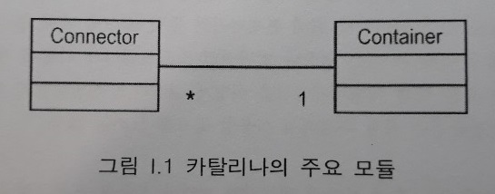

들어가며
=====
* 소스 다운로드: [BRAINY SOFTWARE](https://brainysoftware.com/download;jsessionid=98722A5BC8F29A8B4CBA7DCB6B6B5DED)(저자의 웹 사이트)
* 소스 실행환경: J2SE 1.4
* 소스 구성: 톰캣 4.1.12 및 예제 코드
- - -
## 목차
1. [개요](#개요)
2. [요약](#요약)
	* [누구를 위한 책인가](#누구를-위한-책인가)
	* [서블릿 컨테이너의 작동 원리](#서블릿-컨테이너의-작동-원리)
	* [카탈리나 구성도](#카탈리나-구성도)
	* [톰캣 4와 톰캣 5](#톰캣-4와-톰캣-5)
	* [각 장의 소개](#각-장의-소개)
3. [참고](#참고)

## 개요
이 책에서는 톰캣 4.1.12와 5.0.18을 분석하고, 무료 오픈소스이자 가장 많이 사용되는 서블릿 컨테이너인 카탈리나(Catalina)에 관해 설명한다.

톰캣은 서로 다른 다양한 컴포넌트로 이루어진 복잡한 시스템이다. 톰캣 내부 작동 원리를 공부하고 싶어하는 사람들은 종종 어디서부터 시작할지 잘 모르는 경우가 있다. 이 책은 우선 톰캣 시스템에 대한 큰 그림을 제시한 뒤, 각 컴포넌트의 간략한 버전을 직접 빌드해본다.

##### [목차로 이동](#목차)

## 요약
**들어가며**에서는 이 책의 구성과 이 책에서 빌드할 애플리케이션을 간략히 소개한다.

### 누구를 위한 책인가
* 서블릿/JSP 프로그래머나 톰캣 사용자, 서블릿 컨테이너의 작동 원리에 관심있는 독자  
  - 톰캣을 설정하거나 직접 수정해서 사용할 수 있음
* 톰캣 개발에 직접 참여하기 위해 현재까지의 톰캣 소스에 대해 분석할 필요를 느끼는 독자
* 웹 개발에 관여해 본 적은 없으나 일반적이니 소프트웨어가 어떻게 개발되는지 관심있는 독자  
  - 톰캣과 같은 대형 애플리케이션을 어떻게 설계하고 개발하는지 배울 수 있음

이 책의 내용을 이해하려면, 우선 자바의 객체지향 개념과 서블릿 프로그래밍을 알고 있어야 한다.

##### [목차로 이동](#목차)

### 서블릿 컨테이너의 작동 원리
서블릿 컨테이너는 복잡한 시스템이다. 하지만 서블릿 컨테이너가 서블릿에 대한 요청을 처리할 때 기본적으로 하는 일은 세 가지다.

* .
* .
* .

##### [목차로 이동](#목차)

### 카탈리나 구성도
앞의 [서블릿 컨테이너의 작동 원리](#서블릿-컨테이너의-작동-원리) 절에서 언급한 내용을 바탕으로, 카탈리나는 커넥터와 컨테이너라는 2개의 주요 모듈로 구성돼 있다고 생각할 수 있다.

 

커넥터는 요청을 컨테이너에 연결해주는 모듈이다. 커넥터의 역할은 전달받은 각 HTTP에 대해 요청 객체와 응답 객체를 구성하고, 컨테이너에 전달하는 것이다. 컨테이너는 커넥터로부터 요청 및 응답 객체를 전달받고, 서블릿의 service 메소드를 호출할 책임을 진다.

이것은 단지 빙산의 일각이다. 예를 들어 서블릿을 로드하고(로더 모듈), 사용자를 인증하며, 해당 사용자의 세션을 갱신하는(매니저 모듈) 등 많은 일들이 서블릿의 service 메소드를 호출하기 전에 수행돼야 한다. 따라서 컨테이너가 각각의 작업을 위해 서로 다른 여러 모듈을 사용한다는 사실은 놀라운 일이 아니다.

##### [목차로 이동](#목차)

### 톰캣 4와 톰캣 5
이 책에서 다루는 톰캣 버전 사이에는 다음과 같은 몇 가지 차이점이 있다.

* 지원 버전
	* 톰캣 5 → 서블릿 2.4와 JSP 2.0 표준
	* 톰캣 4 → 서블릿 2.3와 JSP 1.2 표준
* 톰캣 5가 자원 적게 사용(∵ 백그라운드 처리 담당 스레드 별도 사용)
* 톰캣 5가 코드 더 간략(∵ 하위 컴포넌트 찾을 때 맵퍼 컴포넌트 미사용)

##### [목차로 이동](#목차)

### 각 장의 소개
이 책은 총 20장으로 되어 있으며 처음 2장은 개론으로 1장은 HTTP 서버가 어떻게 작동하는지, 2장은 간단한 서블릿 컨테이너를 다룬다. 3장과 4장은 커넥터를, 5장부터 20장까지는 컨테이너에 포함된 컴포넌트를 설명한다. 각 장에서는 그 장에서 설명하는 컴포넌트와 유사한 예제 애플리케이션을 제시한다.

* 1장: 간단한 HTTP 서버 설명
	* 실제 작동하는 HTTP 서버를 직접 빌드하는데 필요한 `java.net` 패키지의 클래스 2개 관해 배경지식 소개  
	  (`Socket`과 `ServerSocket`의 내부 작동원리)
* 2장: 간단한 서블릿 컨테이너의 작동 방식 설명
	* 정적 자원뿐 아니라 간단한 서블릿도 서비스할 수 있는 2개의 서블릿 컨테이너 애플리케이션 작성
	* 특히 요청/응답 객체를 생성하는 방법 및 이를 서블릿의 service 메소드에 전달하는 방법 설명
	* 서블릿 컨테이너 안에서 운영할 수 있는, 즉 브라우저에서 직접 호출할 수 있는 서블릿 설명
* 3장: 톰캣 4의 기본 커넥터를 간략화한 커넥터 소개
* 4장: 톰캣 4의 기본 커넥터 설명
* 5장: 컨테이너 모듈 설명
	* `org.apache.catalina.Container` 인터페이스로 구현
	* 네 가지 종류: 엔진(engine), 호스트(host), 컨텍스트(context), 래퍼(wrapper)
	* 여기에서는 컨텍스트 및 래퍼 사용하는 애플리케이션 소개
* 6장: Lifecycle 인터페이스 설명
	* 카탈리나 컴포넌트의 생명주기를 정의하는 인터페이스
	* 하나의 컴포넌트에서 발생한 이벤트를 다른 컴포넌트에 전달하는 방법 제공
	* 한 번의 시작과 중지로 카탈리나의 모든 컴포넌트 시작/중지 가능
* 7장: 로거(logger) 설명
* 8장: 로더(loader) 설명
* 9장: 매니저 설명
* 10장: 웹 애플리케이션의 보안에 대한 설명
* 11장: `org.apache.catalina.core.StandardWrapper` 클래스 설명
* 12장: `org.apache.catalina.core.StandardContext` 클래스 설명
* 13장: 남은 컨테이너들 및 각각의 구현 클래스 설명
* 14장: 서버 컴포넌트와 서비스 컴포넌트 설명
* 15장
* 16장
* 17장
* 18장
* 19장
* 20장

##### [목차로 이동](#목차)

## 참고

##### [목차로 이동](#목차)