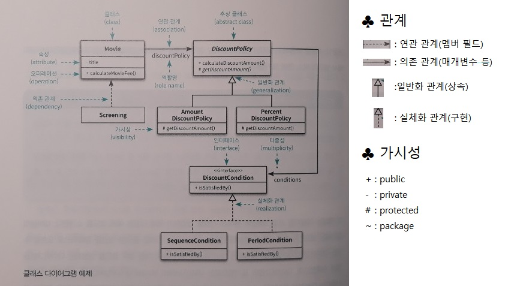
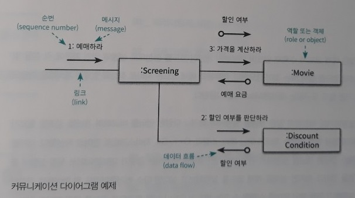
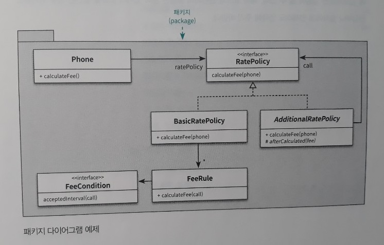

00_프로그래밍 패러다임
=====
책을 읽고 각 단원을 요약한다.  
[링크](README.md)를 누르면 전체 목차로 돌아갈 수 있다.
- - -
## 목차
1. [요약](#요약)
2. [참고](#참고)
	* [책에서 사용한 표기법](#책에서-사용한-표기법)

## 요약

##### [목차로 이동](#목차)

## 참고
### 책에서 사용한 표기법
* 클래스 다이어그램  
	 
	* [클래스 다이어그램 작성법](https://gmlwjd9405.github.io/2018/07/04/class-diagram.html)
* 커뮤니케이션 다이어그램  
	 
* 패키지 다이어그램  
	 

##### [목차로 이동](#목차)
