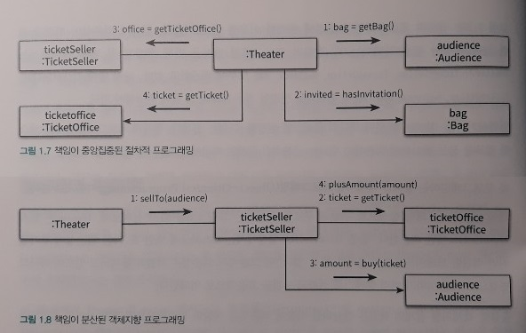

01_객체, 설계
=====
책을 읽고 각 단원을 요약한다.  
[링크](README.md)를 누르면 전체 목차로 돌아갈 수 있다.
- - -
## 목차
1. [요약](#요약)
	* [티켓 판매 애플리케이션 구현하기](#티켓-판매-애플리케이션-구현하기)
	* [너무 많은 클래스에 의존하는 Theater](#너무-많은-클래스에-의존하는-Theater)
	* [Theater의 결합도를 낮춘 설계](#Theater의-결합도를-낮춘-설계)
	* [추가 개선](#추가-개선)
		* [책임의 이동](#책임의-이동)
		* [절차지향과 객체지향](#절차지향과-객체지향)
2. [참고](#참고)
	* 메서드 네이밍 컨벤션
	* 메서드 오버로딩
	* 리스트와 배열
	* 

## 요약
### 티켓 판매 애플리케이션 구현하기
* 요구사항
	* 초대장 소지/미소지 관객 다른 방식으로 입장
* UML: 핵심 클래스  
	 

##### [목차로 이동](#목차)

### 너무 많은 클래스에 의존하는 Theater
* UML  
	 
* 문제점
	* 변경 어려움  
	(`Audience`와 `TicketSeller`를 변경할 경우 `Theater`도 함께 번경해야 함)
	* 가독성 낮음: 코드를 이해하기 위해 여러 세부적인 내용 기억 필요  
	(`Theater`의 enter 메서드를 이해하기 위해서는 `Audience`가 Bag을 가지고 있고, Bag 안에는 현금과 티켓이 들어 있으며 `TicketSeller`가 TicketOffice에서 티켓을 판매하고, `TicketOffice` 안에 돈과 티켓이 보관돼 있다는 모든 사실 기억 필요)

----
로버트 마틴은 <클린 소프트웨어: 애자일 원칙과 패턴, 그리고 실천 방법>에서 소프트웨어 모듈이 가져야 하는 세 가지 기능(목적)에 관하여 설명한다.

> * 첫 번째 목적은 실행 중에 제대로 동작하는 것이다.
> * 두 번째 목적은 변경을 위해 존재하는 것이다.
> * 세 번째 목적은 코드를 읽는 사람과 의사소통하는 것이다.

##### [목차로 이동](#목차)

### Theater의 결합도를 낮춘 설계
* UML  
	 
	* `Theater`의 로직을 `TicketSeller`로 이동시킨 결과, `Theater`에서 `TicketOffice`로의 의존성이 제거됨  
	(즉, `TicketOffice`와 협력하는 `TicketSeller`의 내부 구현이 성공적으로 캡슐화됨)
	* `Theater`는 오직 `TicketSeller`의 **인터페이스**(interface)에만 의존함
		* `TicketSeller`가 내부에 `TicketOffice` 인스턴스를 포함하고 있다는 사실은 구현(implementation)의 영역
		* 여기서 인터페이스는 타입(형)으로 이해

----
**변경에 취약한 코드**를 개선하기 위해 **의존성을 제거**하는 과정을 거쳤다. 코드를 통해 어느 정도 이해가 가능하지만 정리해보면, **의존성**(dependency)이란 변경에 대한 영향을 암시한다. 즉, 의존성이라는 말 속에는 어떤 객체가 변경될 때 그 객체에게 의존하는 다른 객체도 함께 변경될 수 있다는 사실이 내포돼 있다. 하지만 객체 사이의 의존성을 완전히 없애는 것이 정답은 아니다. 우리의 목표는 필요한 최소한의 의존성만 유지하고 불필요한 의존성을 제거하는 것이다.

한편 객체 사이의 의존성이 과한 경우를 가리켜 **결합도**(coupling)가 높다고 말한다. 결합도는 의존성과 관련되어 있기 때문에 결합도 역시 변경과 관련이 있다. 두 객체 사이의 결합도가 높으면 높을수록 함께 변경될 확률도 높아지기 때문에 변경하기 어려워진다.

의존성(혹은 결합도)이 높을 때, 해결 방법은 **캡슐화**(encapsulation)이다. 캡슐화의 목적은 객체 내부의 세부적인 사항을 감춤으로써, 변경하기 쉬운 객체를 만드는 것이다. 즉 캡슐화를 통해 객체 내부로의 접근을 제한하면, 객체와 객체 사이의 결합도를 낮출 수 있기 때문에 설계를 좀 더 쉽게 변경할 수 있게 된다. 코드를 예로 들면, `Theater`가 `Audience`와 `TicketSeller`에 관해 너무 세세한 부분까지 알지 못하도록 정보를 차단하면 된다. 설계를 변경하기 어려운 이유는 `Theater`가 `Audience`와 `TicketSeller`뿐만 아니라(**여기까진 인터페이스**) `Audience` 소유의 Bag과 `TicketSeller`가 근무하는 TicketOffice까지 마음대로 접근할 수 있기 때문이다. 해결 방법은 `Audience`와 `TicketSeller`가 직접 Bag과 TicketOffice를 처리하는 자율적인 존재가 되도록 설계를 변경하는 것이다.

##### [목차로 이동](#목차)

### 추가 개선
`TicketSeller` 다음으로 `Audience`의 캡슐화를 개선한다. `TicketSeller`는 `Audience`의 getBag 메서드를 호출해서 `Audience` 내부의 Bag 인스턴스에 직접 접근한다. Bag 인스턴스에 접근하는 객체가 `Theater`에서 `TicketSeller`로 바뀌었을 뿐 `Audience`는 여전히 자율적인 존재가 아닌 것이다. 따라서 Bag에 접근하는 모든 로직을 `Audience` 내부로 감추기 위해 `Audience`에 buy 메서드르르 추가하고 `TicketSeller`의 sellTo 메서드에서 getBag 메서드에 접근하는 부분을 buy 메서드로 옮긴다.

* UML  
	 

#### 책임의 이동

 

##### [목차로 이동](#목차)

#### 절차지향과 객체지향

##### [목차로 이동](#목차)

## 참고

##### [목차로 이동](#목차)
