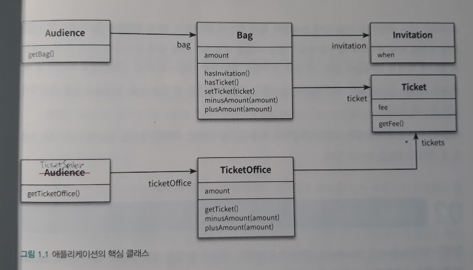
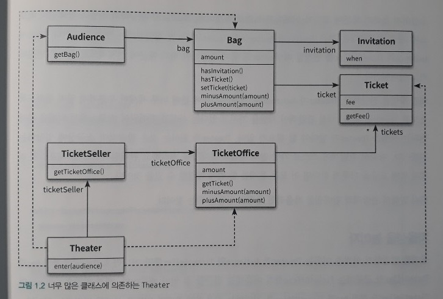
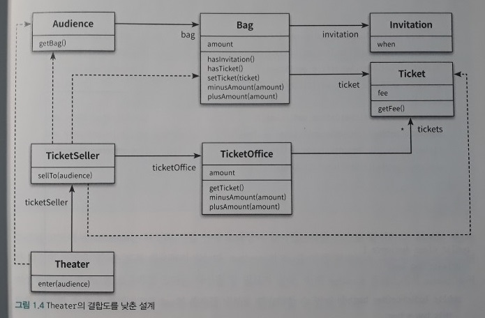
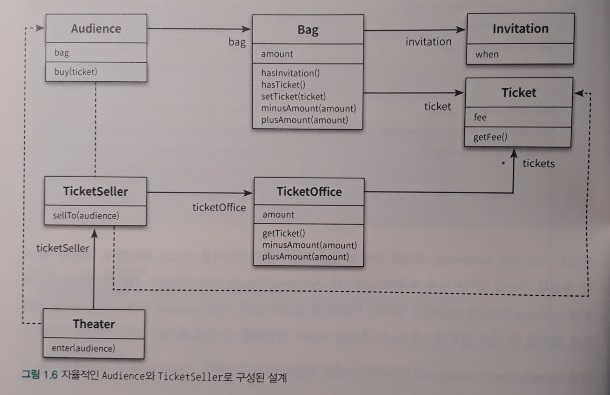

01_객체, 설계
=====
책을 읽고 각 단원을 요약한다.  
[링크](README.md)를 누르면 전체 목차로 돌아갈 수 있다.
- - -
## 목차
1. [요약](#요약)
	* [티켓 판매 애플리케이션 구현하기](#티켓-판매-애플리케이션-구현하기)
	* [너무 많은 클래스에 의존하는 Theater](#너무-많은-클래스에-의존하는-Theater)
	* [Theater의 결합도를 낮춘 설계](#Theater의-결합도를-낮춘-설계)
	* [추가 개선](#추가-개선)
		* [책임의 이동](#책임의-이동)
		* [절차지향과 객체지향](#절차지향과-객체지향)
2. [참고](#참고)
	* 메서드 네이밍 컨벤션
	* 메서드 오버로딩
	* 리스트와 배열
	* 

## 요약
### 티켓 판매 애플리케이션 구현하기
* 요구사항
	* 초대장 소지/미소지 관객 다른 방식으로 입장
* UML: 핵심 클래스  
	 

##### [목차로 이동](#목차)

### 너무 많은 클래스에 의존하는 Theater
* UML  
	 
* 문제점
	* .

##### [목차로 이동](#목차)

### Theater의 결합도를 낮춘 설계
* UML  
	 
	* `Theater`의 로직을 `TicketSeller`로 이동시킨 결과, `Theater`에서 `TicketOffice`로의 의존성이 제거됨
* 문제점
	* .

##### [목차로 이동](#목차)

### 추가 개선

* UML  
	 

#### 책임의 이동

##### [목차로 이동](#목차)

#### 절차지향과 객체지향

##### [목차로 이동](#목차)

## 참고

##### [목차로 이동](#목차)
