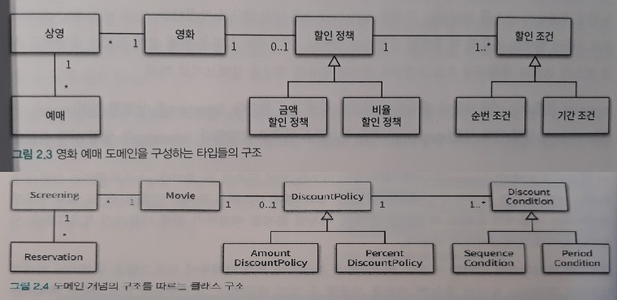

02_객체지향 프로그래밍
=====
책을 읽고 각 단원을 요약한다.  
[링크](README.md)를 누르면 전체 목차로 돌아갈 수 있다.
- - -
## 목차
1. [요약](#요약)
	* [영화 예매 시스템 구현하기](#영화-예매-시스템-구현하기)
2. [참고](#참고)

## 요약
### 영화 예매 시스템 구현하기
* 요구사항
	* 하나의 `영화`는 하루 중 다양한 시간대에 걸쳐 한 번 이상 `상영`
		* 영화: 제목, 상영시간, 가격 정보 등
		* 상영: 실제 관객들이 영화를 관람하는 사건
	* 특정 조건을 만족하는 예매자는 요금 할인
		* 할인 조건: 가격 할인 여부 결정
			* 순서 조건
			* 기간 조건
		* 할인 정책: 할인 요금 결정
			* 금액 할인 정책
			* 비율 할인 정책
	* 기타
		* 영화 : 할인 정책 = 1 : 0..1
		* 영화 : 할인 조건 = 1 : 0..*
* 시나리오  
	> 사용자가 가격이 10,000원인 '아바타'를 예매한다고 가정하자. 이 영화에는 800원의 금액 할인 정책이 적용되어 있다. 따라서 사용자의 예매 정보가 할인 조건을 만족할 경우 1인당 800원의 요금을 할인해줘야 한다. 아바타의 할인 조건은 두 개의 순번 조건(조조, 10번째)과 두 개의 기간 조건(월요일 10시에서 12시 사이에 시작, 목요일 18시에서 21시 사이에 시작)으로 구성돼 있다. 이 조건을 만족하는 영화를 예매할 경우 원래 가격인 10,000원에서 할인 요금인 800원만큼을 할인받을 수 있기 때문에 사용자는 9,200원에 영화를 예매할 수 있다. 할인 정책은 1인을 기준으로 책정되기 때문에 예약 인원이 두 명이라면 1,600원의 요금을 할인받을 수 있다.  
	> 사용자가 예매를 완료하면 예매 정보를 생성한다. 예매 정보에ㅐ는 제목, 상영 정보, 인원, 정가, 결제금액이 포함된다.
* UML: 핵심 클래스  
	 

##### [목차로 이동](#목차)

## 참고

##### [목차로 이동](#목차)