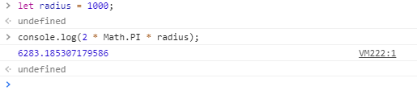

자바스크립트 기초
=====
* 입문자용 자바스크립트 스터디
* 개발자들이 사용하는 언어(→ 영어)를 배우게 됨
- - -
## 목차
1. [1강](#1강)
2. [2강](#2강)
3. [3강](#3강)
4. [4강](#4강)
5. [5강](#5강)
6. [6강](#6강)
7. [참고](#참고)

## 1강
1. [Variables and Data Type](#Variables-and-Data-Type)
2. [Programming Language](#Programming-Language)
3. [Lexical grammer](#Lexical-grammer)
4. [Basic grammer](#Basic-grammer)

### Variables and Data Type

##### [목차로 이동](#목차)

### Programming Language
1. Code
2. Machine Language
3. Run

흔히 개발하면서 거치는 위 단계를 보며 개발, 즉 Programming이란 무엇인지 살펴본다.

* Programming은 Program을 만드는 행위
* Program은 컴퓨터가 실행할 수 있는 메모리에 올라와 있는 덩어리(→ Machine Language: Interprete & Compile)

허나 여기서 Compile 부분은 어려우니, 우리는 Code 단계를 배운다고 할 수 있다.

##### [목차로 이동](#목차)

### Lexical grammer
> In computer science, a **lexical grammer** is a formal grammer defining the syntax of tokens.  
> [위키백과](https://en.wikipedia.org/wiki/Lexical_grammar)

* Control characters
* White space
* Line terminators
* Comments
* Keywords
	* [인터프리터](https://ko.wikipedia.org/wiki/%EC%9D%B8%ED%84%B0%ED%94%84%EB%A6%AC%ED%84%B0)가 보기에 미리 예약되어 있어 식별자(변수의 이름)로 사용할 수 없는 단어들
	* `undefined`는 식별자가 아니라 변수명으로 사용 가능하나 비권장
* Literals: 더 이상 나눌 수 없는 값의 표현

- - -
* [어휘 문법 - MDN web docs](https://developer.mozilla.org/ko/docs/Web/JavaScript/Reference/Lexical_grammar)

##### [목차로 이동](#목차)

### Basic grammer
자바스크립트는 세 가지 구성요소를 갖고 있다.

1. Statements(문)  
	```txt
	해석기에 내리는 힌트(→ 기계어를 보면 실체가 없음)
	
	empty statement(공문): ;;;;
	block statement(중문): { }
	(flow) control statement(제어문): 명령이 실행되고 순환되는 흐름 제어(폰 노이만 머신)
	expression statement(식): 식을 문으로 인정(→ 3 + 1;)
	declare statement
	```
2. Expressions(표현식)  
	```txt
	값(→ 기계어에 흔적이 남음)
	2 === 1 + 1(→ 표현식은 값임)
	
	value expression(값): 3
	operation expression: 3 + 1
	call expression: a(1)
	```
3. Variables(변수)  
	```txt
	(표현)식의 결과를 메모리에 기억시킬 필요가 있을 때 사용
	변수에 들어가는 건 오직 식(문: x)만 가능
	
	past: var
	now: let, const(선언과 동시 할당 필요)
	```

- - -
* Operations  
	```txt
	assignment
	  - 언어에 따라 문에 분류되기도, 식에 분류되기도 함
	  - 자바스크립트의 경우 식에 분류되므로 하나의 값으로 귀결
	  - ex. a = 3; → 자바스크립트에서 할당(선언: x)은 우항의 값(3)으로 귀결
	arithmetic
	logical
	conditional
	unary
	comparison
	bitwise
	string
	comma
	relational
	```
* ECMAScript  
	```txt
	ECMAScript - 자바스크립트의 공식적인 표준을 에크마스크립트라 함
	  - 자바스크립트는 상위버전이 하위버전을 완전히 호환되도록 작성됨
	
	ECMAScript3.1  - IE8까지의 사용. 그 외 브라우저가 지원
	ECMAScript5    - IE9 ~ 11까지 사용. 그 외 모든 브라우저가 지원
	ECMAScript2015 - Edge, Chrome, Firefox 등 모던 브라우저가 지원
	```
* 예제  
	```javascript
	1 + 1 		// 2
	var a = 3;	// undefined; Statements는 값 반환 x
	a;		// 3
	
	/*
	 * 1: 가장 안에 있는 괄호부터 해석
	 * undefined
	 * undefined
	 */
	console.log(console.log(1));
	```
	
##### [목차로 이동](#목차)

## 2강
1. [Data type](#Data-type)
2. .


##### [목차로 이동](#목차)

### Data type
컴퓨터에서 기록은 어떻게 되는가? 이를 설명하는 키워드가 Data type이다.

* Data: 메모리에 넣을 값
* Type: 값의 ~~종류~~크기

조금 더 자세히 정리하면 아래와 같다.

```txt
- 메모리: (얼마나 오래인지는 차치하고) 내가 원하는 상태 혹은 값을 기억할 수 있는 것(→ 스위치)
- 스위치(메모리) 하나의 단위: 1bit(0 ~ 1)
- 1byte = 8bit ＝ 2^8(0 ~ 255)
- 우리가 흔히 얘기하는 16bit 컴퓨터는 한 번에 메모리에 값을 쓸 때 2byte씩 쓰는 컴퓨터

- 메모리의 두 가지 특성
  1. 메모리 상태(값)
  2. 어디에 들어있니(위치, 주소)
- 3을 2byte에 쓰는 경우와 1byte에 쓰는 경우는 다름(스위치로 생각)
  - 즉 같은 값이지만 메모리 블록을 몇 개 사용하는 공간에 값을 적느냐에 따라 기록 방법이 달라짐
  
- var a = 3; // 자바스크립트
  - 변수 a는 메모리 주소의 별명임
  - V-Table(Variable Table): 변수명, 주소, 데이터 타입
```

s69/2/44:40

##### [목차로 이동](#목차)

## 3강
1. [Variable](#Variable)
2. .

##### [목차로 이동](#목차)

### Variable
</br>

위 코드로부터 알 수 있는 점은 변수는 값을 대체할 수 있다는 점이다. 그렇다면 우리가 값 대신 변수를 쓰면 좋은 점이 무엇일까?

1. 수식의 의미를 명확히 할 수 있음
2. 값을 직접 입력하면 그것을 수정하기 어려움
3. 값을 몰라도 코드 작성 가능(*1,2와는 다른 관점같은*)

만약 값이 들어오는 경우(한글 리터럴 포함), 코드 작성자만 안다는 의미에서 [Magic number](https://en.wikipedia.org/wiki/Magic_number_(programming))라고 부른다.

s69/3/18:00

##### [목차로 이동](#목차)

## 4강

##### [목차로 이동](#목차)

## 5강

##### [목차로 이동](#목차)

## 6강

##### [목차로 이동](#목차)

## 참고
* [메모리 저장 단위와 메모리 크기 표시 단위](https://m.blog.naver.com/PostView.nhn?blogId=tipsware&logNo=221537443580&proxyReferer=https%3A%2F%2Fwww.google.com%2F)
* [CPU와 메모리, 그리고 성능](https://comalien.tistory.com/20)

##### [목차로 이동](#목차)