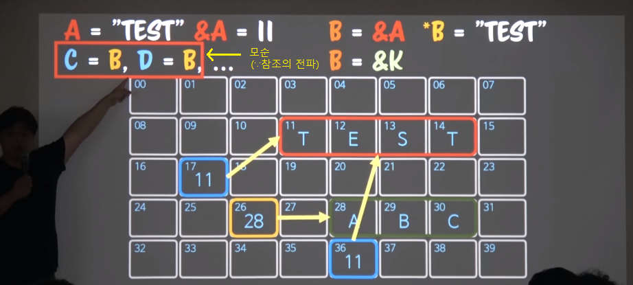
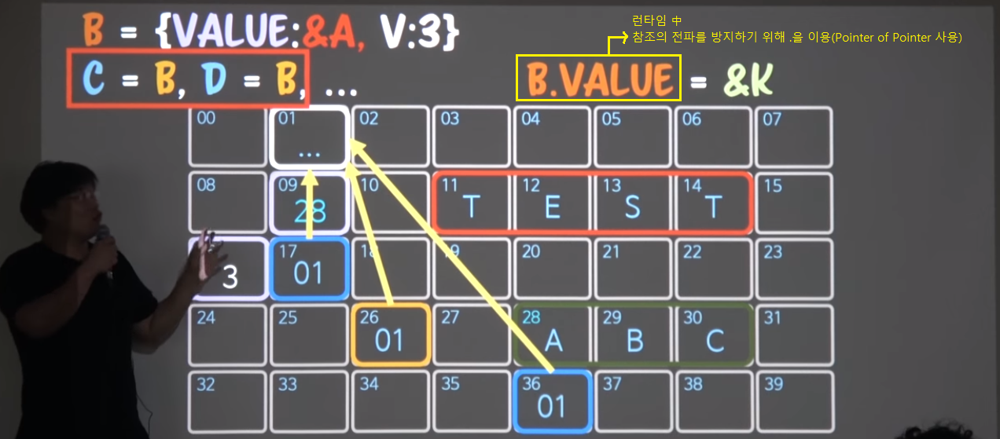
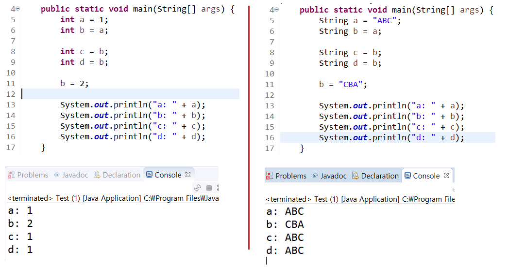
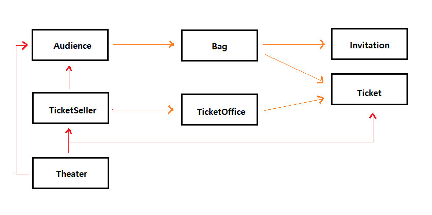
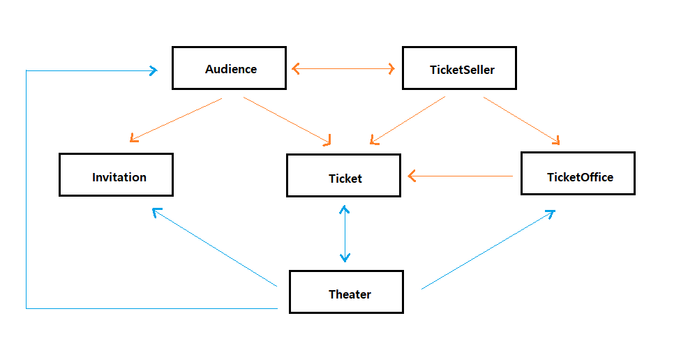

들어가며. 프로그래밍 패러다임  
1장. 객체, 설계
=====
책을 읽기 앞서 프로그래밍 관련 배경 및 객체지향 관련 설명
- - -
## 목차
1. [참고](#참고)
	* [관련자료](#관련자료)
2. [요약](#요약)
	* [들어가며](#들어가며)
		* [역할 모델을 통한 로직의 격리](#역할-모델을-통한-로직의-격리)
		* [Program과 Timing](#Program과-Timing)
		* [Pointer of Pointer](#Pointer-of-Pointer)
		* [Value와 Identifier](#Value와-Identifier)
		* [Polymorphism](#Polymorphism)
	* [객체와 설계](#객체와-설계)
		* [Object](#Object)
		* [Theater](#Theater)
			* [요구사항](#요구사항)
			* [다이어그램](#다이어그램)
			* [코드](#코드)

## 참고
### 관련자료
* 유투브 강의
	* [1회차](https://www.youtube.com/watch?v=sWyZUzQW3IM&t=9s)
	* [2회차](https://www.youtube.com/watch?v=navJTjZlUGk)
* [오브젝트 요약정리](../../../book/object/README.md)

## 요약
### 들어가며
#### 역할 모델을 통한 로직의 격리
요구사항 변화 등으로 인한 여파를 최소화시킬 수 있는 로직 격리 방법으로 객체지향 진영에서 제시하는 단 한 가지 방법이 바로 `역할 모델`이다.

역할 모델을 이해하기 위해선 추상화(`Abstraction`)에 대해 이해해야 한다. 일반적으로 아래와 같은 분류가 가능하다.

* Generalization: `일반화`
	* modeling, function, algorithm
* Association: `연관화`
	* reference, dependence
* Aggregation: `집단화`
	* group, category

한편 프로그래밍 패러다임이 다르면 추상화 방법도 달라진다. 이때 필요한 추상화 방법은 아래와 같다.

* Data Ab
	* Modeling, Categorization, Grouping
* Procedural Ab
	* Generalization, Capsulization
* OOP Ab
	* Generalization, Realization, Dependency, Association, Directed Association, Aggregation, Composition

위에서 보듯, 객체지향에서 사용되는 추상화 기법은 다양하다.
	
##### [목차로 이동](#목차)

#### Program과 Timing
프로그램을 어떻게 정의할 수 있을까? 컴파일한 파일을 프로그램이라고 할 수 있을까? 메모리에 적재돼서 실행될 때부터 프로그램이다. 이렇게 협소한 의미에서 프로그램의 생명주기, Timing을 살펴볼 필요가 있다.

추후 추가

##### [목차로 이동](#목차)

#### Pointer of Pointer
객체지향에서 값을 직접 참조하지 않고 캡슐화해서 사용하는 이유는 참조의 전파 때문이다.

* 문제 상황  
	</br>
* 해결 방안  
	</br>

자바에서 `primitive type`이 아닌 `reference type`의 사용을 권장하는 이유와 같다.

</br>

##### [목차로 이동](#목차)

#### Value와 Identifier
객체 지향을 지원하기 위한 시스템(`OOP base system`)의 조건으로 `값과 식별자`의 구분을 들 수 있다. 식별자란 객체를 구분할 수 있게 해주는 것으로, 런타임에 메모리에 적재되어 있는 객체의 메모리 주소를 말한다(즉, `객체`가 아니라 `인스턴스`로 이해하면 될 듯).

자바에서 문자열 비교 시 `equals()` 메소드로 비교하는데 그 이유는 `==` 연산자로 비교 시 메모리 주소, 즉 `식별자`를 비교하기 때문이다. 반면 `equals()` 메소드는 값 context를 비교한다. 참고로 자바스크립트는 문자열(`String`)을 객체가 아닌 값으로 본다.

즉 **객체지향**에서는 `value`가 아닌 `identifier`로 비교하는 게 맞다(∵ 시스템 자체도 그렇게 만들어졌기 때문). 객체지향에서는 `식별자`를 통해 객체의 협력망을 구성한다. 한편 함수형에서는 `값`을 지향한다. 즉, 참조 지향이 아니다.

```kotlin
// 예제 코드: 잘 몰라서 우선 따라 침
// == : 값 비교
// === : 식별자 비교

class ValueType(val name:String) {
	override operator fun equals(n:Any?) = n == name
}

ValueType("abc") == ValueType("abc")	// True

ValueType("abc") === ValueType("abc")	// False
```

##### [목차로 이동](#목차)

#### Polymorphism
OOP 시스템을 제공하는 언어들은 Polymorphism(`다형성`)을 제공한다. 즉, 오직 Polymorphism을 지원해야 객체지향 시스템이라 할 수 있다.

그렇다면 다형성이란 무엇일까? 다형성을 제공한다 함은 무엇일까? 구체적으로 정의하면 다음 두 가지 조건을 만족해야 한다.

* Substitution: `대체가능성`
* Internal identity: `내적동질성`

먼저 아래 예를 통해 `대체가능성`에 대해 살펴본다.

```kotlin
open class Worker:Runnable {
	override fun run() = println("Working)
}

class HardWorker:Worker() {
	override fun run() = println("HardWorkering")
}

var worker:Runnable = Worker()
println(worker.run())	// Working
worker = HardWorker()
println(worker.run())	// HardWorkering
```

코드를 보면 `Runnable`형의 worker 변수에서 호출한 `run()` 메소드의 결과는 달라질 수 있음을 알 수 있다(`Worker`가 `Runnable` 상속, `HardWorker`가 `Worker` 상속). 이는 세 개의 인스턴스가 이미 메모리에 만들어져서 런타임에 포인터 연쇄(∵ `포인터의 포인터`)로 동적 바인딩되기 때문에 가능하다. 즉, 다형성은 공짜가 아니라 런타임에 포인터 연산을 통해 바인딩(`Mapping`)해주는 것으로 느려질 수 밖에 없다. 이런 `대체가능성`을 구현하는 방법은 언어마다 다른데 자바스크립트를 예로 들면 prototype-chain(`??`)을 말할 수 있다. 이 경우엔 런타임에 매핑하므로 연산 비용이 높다고 할 수 있다.

한편 `동적 바인딩`과 `동적 디스패치`는 비슷한 의미로 생각할 수 있다.

이제 아래 코드를 통해 `내적동질성`에 대해 살펴본다.

```kotlin
open class Worker:Runnable {
	override fun run() = println("Working)
	fun print() = println(run())
}

class HardWorker:Worker() {
	override fun run() = println("HardWorkering")
}

var worker:Worker = HardWorker()
println(worker.print())	// HardWorkering
```

이때 호출되는 `run()` 메소드가 `Worker`와 `HardWorker` 중 어디에 속한 것일까? 바로 후자이다. 즉 `내적동질성`이란 니가 무슨 형(`Type`)으로 바껴도 니가 태어난 출생은 바뀌지 않아, 하는 객체지향에서의 일종의 약속이다.

##### [목차로 이동](#목차)

### 객체와 설계
#### Object
객체지향에서 Object, 즉 객체가 갖춰야 할 기본적인 소양(조건)은 무엇일까? 두 가지가 있다.

* Encapsulation of Functionality: `기능의 캡슐화`
	* 격리(`Isolation`)함으로써 여파가 다른 곳에 미치지 않게 하기 위함
	* 수정 시에 다른 파일을 건드리지 않으면 제대로 되었다 생각 가능
* Maintenance of State: `상태의 관리`
	* `관리`라 함은 `은닉`, `(자율적) 갱신`, `알림` 등 포함
	* 객체지향이 `포인터의 포인터`를 쓰는 이유이기도 함

##### [목차로 이동](#목차)

#### Theater
##### 요구사항
티켓 판매 애플리케이션의 요구사항은 다음과 같다.

* **티켓**을 소지한 **관람객**만 **소극장**에 입장할 수 있다.
* 관람객을 입장시키기 전에 **이벤트 당첨 여부를 확인**해야 한다.
	* 이벤트 당첨자: 초대장을 티켓으로 교환
	* 이벤트 비당첨자: 티켓을 판매한 후 입장

##### [목차로 이동](#목차)

##### 다이어그램
책의 `Theater` 예제는 절차지향으로부터 객체지향까지 가는 과정을 설명하기 위해 만들었기 때문에 정교한 역할모델이 지정되어 있지 않다(`역할모델`이 아니라 `프로시저`를 옮겨놨을 뿐).

초기 버전의 클래스간 의존성을 나타내는 UML이다.

</br>


.
</br>

##### [목차로 이동](#목차)

##### 코드


##### [목차로 이동](#목차)
