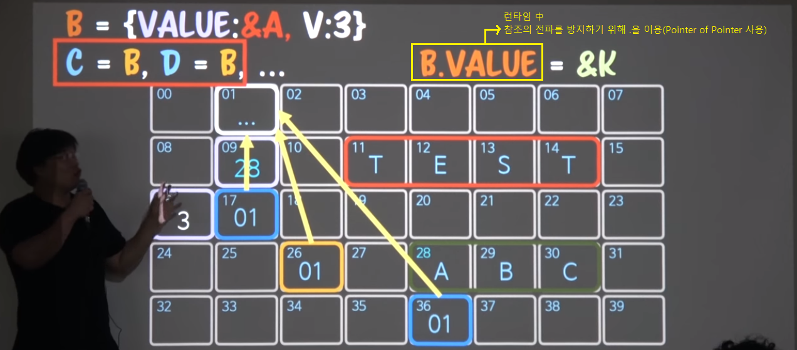
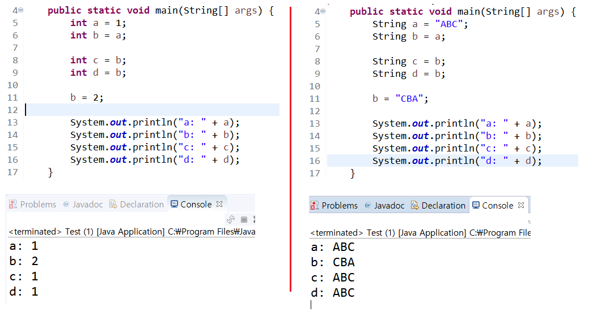

들어가며. 프로그래밍 패러다임
=====
책을 읽기 앞서 프로그래밍 관련 배경 설명
- - -
## 목차
1. [참고](#참고)
	* [관련자료](#관련자료)
2. [요약](#요약)
	* [역할 모델을 통한 로직의 격리](#역할-모델을-통한-로직의-격리)
	* [Program & Timing](#Program-&-Timing)
	* [Pointer of Pointer](#Pointer-of-Pointer)

## 참고
### 관련자료
* [유투브 강의](https://www.youtube.com/watch?v=sWyZUzQW3IM&t=9s)
* [오브젝트 요약정리](../../../book/object/README.md)

## 요약
### 역할 모델을 통한 로직의 격리
요구사항 변화 등으로 인한 여파를 최소화시킬 수 있는 로직 격리 방법으로 객체지향 진영에서 제시하는 단 한 가지 방법이 바로 `역할 모델`이다.

역할 모델을 이해하기 위해선 추상화(`Abstraction`)에 대해 이해해야 한다. 일반적으로 아래와 같은 분류가 가능하다.

* Generalization: `일반화`
	* modeling, function, algorithm
* Association: `연관화`
	* reference, dependence
* Aggregation: `집단화`
	* group, category

한편 프로그래밍 패러다임이 다르면 추상화 방법도 달라진다. 이때 필요한 추상화 방법은 아래와 같다.

* Data Ab
	* Modeling, Categorization, Grouping
* Procedural Ab
	* Generalization, Capsulization
* OOP Ab
	* Generalization, Realization, Dependency, Association, Directed Association, Aggregation, Composition

위에서 보듯, 객체지향에서 사용되는 추상화 기법은 다양하다.
	
##### [목차로 이동](#목차)

### Program & Timing
프로그램을 어떻게 정의할 수 있을까? 컴파일한 파일을 프로그램이라고 할 수 있을까? 메모리에 적재돼서 실행될 때부터 프로그램이다. 이렇게 협소한 의미에서 프로그램의 생명주기, Timing을 살펴볼 필요가 있다.

추후 추가

##### [목차로 이동](#목차)

### Pointer of Pointer
객체지향에서 값을 직접 참조하지 않고 캡슐화해서 사용하는 이유는 참조의 전파 때문이다.

* 문제 상황  
	 
* 해결 방안  
	 

자바에서 `primitive type`이 아닌 `reference type`의 사용을 권장하는 이유와 같다.

 

##### [목차로 이동](#목차)