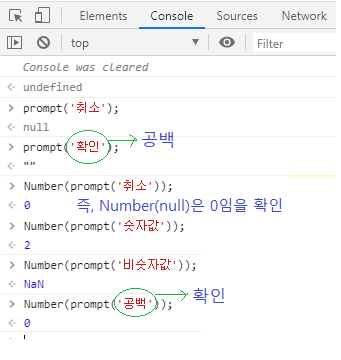

웹 게임을 만들며 배우는 자바스크립트
=====
2019, [제로초의 강의](https://www.inflearn.com/course/%EC%9E%90%EB%B0%94%EC%8A%A4%ED%81%AC%EB%A6%BD%ED%8A%B8-%EA%B2%8C%EC%9E%84-%EA%B0%9C%EB%B0%9C#)를 듣고 정리한다.  
기초부터 심화까지 많은 예제를 접할 수 있는 강의라 기대된다.  
강의자는 클래스, for를 쓰지 않고 함수형을 선호한다고 한다.
- - -
## 목차
1. [기본](#기본)
	* [REPL](#REPL)
	* [자료형과 연산자](#자료형과-연산자)
		1. 값: 숫자, 문자, 불린
		2. 연산자
	* [변수](#변수)
		1. var
		2. null, undefined
	* [조건문과 반복문](#조건문과-반복문)
		1. 이중 for문
	* [함수](#함수)
	* [객체와 배열](#객체와-배열)
		1. 객체와 JSON
		2. [메소드와 함수](#메소드와-함수)
		3. [배열 내 메소드](#배열-내-메소드)
2. [웹 화면 구현](#웹-화면-구현)
	* [window 객체](#window-객체)
	* [document 객체와 DOM](#document-객체와-DOM)
	* [script 태그 사용법](#script-태그-사용법)
	* [JS로 HTML 태그 만들기](#JS로-HTML-태그-만들기)
		* [이벤트 리스너 맛보기](#이벤트-리스너-맛보기)
	* [사용자 경험 반영](#사용자-경험-반영)
3. [심화](#심화)
	* .
	* .
4. [예제](#예제)
	* [끝말잇기](#끝말잇기)
	* [구구단](#구구단)
	* [숫자야구](#숫자야구)
	* 틱택토
	* 로또 추첨기
	* 가위바위보
	* 지뢰찾기
	* 반응속도 테스트
	* 틱택토 심화
	* 카드 짝맞추기 게임
	* 자스스톤
	* 2048
	* 테트리스
5. [참고](#참고)
	
## 기본

### REPL
크롬 브라우저를 키고 `F12`를 누르면 Console 탭이 보이는데 이를 REPL(`READ EVALUATE PRINT LOOP`)라 한다. 이는 윈도우 커맨드, 혹은 UNIX/LINUX Shell처럼 사용자가 커맨드를 입력하면 시스템이 값을 반환하는 환경을 가리킨다.

* READ: (브라우저가) 값을 입력받아 메모리에 저장
	* 메모리에 저장된 값은 브라우저 새로고침 이후에 휘발
* EVALUATE: 데이터를 처리
* PRINT: 결과값을 출력
* LOOP

이 탭에서 간단한 코드를 테스트해볼 수 있는데 아래 두 코드의 결과값을 예측해볼 수 있다.

* 코드1  
	```javascript
	'안녕하세요'
	'안녕하세요'
	'안녕하세요'
	```
* 코드2  
	```javascript
	console.log('안녕하세요')
	console.log('안녕하세요')
	console.log('안녕하세요')
	```

첫 번째 코드의 경우 마지막이 이전의 값을 덮어씌우기 때문에 한 번의 '안녕하세요'가 출력되고, 두 번째 코드의 세 번이 출력된다.

참고로 줄 띄우기는 `Shift + Enter`다.

##### [목차로 이동](#목차)

### 자료형과 연산자
컴퓨터가 **값**을 구분(`Categorize`)하기 위한 일종의 바구니가 **자료형**이다. 같은 자료형의 경우 연산자를 통해 연산할 수 있다.

```javascript
5 >= 4		// true
4 == 1 * 5	// false
1 == '1'	// true - 자료형 변환 후 비교
1 === '1'	// false
5 != '5'	// false - 자료형 변환 후 비교
5 !== '5'	// true
```
- - -
강좌에서 언급했던 (초보의 경우) 유용한 몇 가지 팁이 있다.

* `==` 대신 `===`을 사용하라
	* 유일한 예외  
		```javascript
		NaN === NaN // false
		```
* `undefined` 대신 `null`을 사용하라
	* 자료형 비교  
		```javascript
		null == undefined	// true
		null === undefined	// false
		```
	* 의도 차이  
	`undefined`: 컴퓨터가 default로 넣어준 값  
	`null`: 개발자가 넣어준 값
* 문자열을 만드는 방법엔 세 가지가 있음(', ", `)

참고로 제곱 연산자는 `**`이다(ex. 3`**`2 `===` 9).
	
##### [목차로 이동](#목차)

### 변수
컴퓨터가 알려준 값은 휘발성이다(ex. `1 * 5`). 이 값을 재사용하기 위해 변수를 사용한다. 즉, 변수(ex. `var`)를 이용하면 계산 결과를 컴퓨터에게 기억시킬 수 있다.

참고로, 변수란 값이 저장되어 있는 **메모리 주소의 별칭**이다.

##### [목차로 이동](#목차)

### 조건문과 반복문
각각 간단한 예는 아래와 같다.

```javascript
// 조건문
if (3 * 8 === Number(prompt("답?"))) {	// 딩동댕
	"딩동댕"
} else {
	"땡"
}

// 반복문
var 값 = 0
while(값 < 5) {
	console.log(값)
	값 = 값 + 1
}
```

한 마디로 프로그램의 **제어 흐름**을 결정한다고 이해할 수 있다(플로우 차트를 생각). 추가로 아래는 강의에서 언급한 이중 for문의 예제이다.

1. 직각 삼각형 1  
	```javascript
	for(var star = 5; star >= 1; star = star - 1) {
		console.log('*'.repeat(star));
	}
	
	for(var star = 10; star >= 2; star = star - 2) {
		console.log('*'.repeat(star));
	}
	
	for(var star = 1; star <= 16; star = star * 2) {	// 반복문 밖에서 star 찍어보면 32가 나옴
		console.log('*'.repeat(star));
	}
	```
2. 직각 삼각형 2  
	```javascript
	for(var star = 5; star >= 1; star = star - 1) {
		console.log(' '.repeat(5 - star) + '*'.repeat(star));
	}
	```
3. 이등변 삼각형  
	```javascript
	for(var star = 9; star >= 1; star = star - 2) {
		console.log(' '.repeat((9 - star) / 2) + '*'.repeat(star));
	}
	
	for(var star = 9, gap = 0; star >= 1, gap <= 4; star = star - 2, gap += 1) {
		console.log(' '.repeat(gap) + '*'.repeat(star));
	}
	```
4. 마름모  
	```javascript
	// 힌트: Math.abs
	```

- - -
1. 앞으로 알아보겠지만 위의 예에서 언급한 `Number()` 및 `prompt()`는 함수이고, `console.log()`는 메소드이다.
2. 무한 반복 빠져나가고 싶다면 `shift + esc` 후 프로세스 종료

##### [목차로 이동](#목차)

### 함수
이미 몇 번 함수를 사용해왔다.

```javascript
String(5)	// "5"
prompt("답을 입력하시오")	// 5
Number("10")	// 5
```

이렇게 브라우저**에** 내장된 함수들(`alert()`, `prompt()`, `console.log()`)이 있고 아래와 같이 직접 선언해서 사용할 수도 있다.

```javascript
function 함수(x, y) {
	return x + y + 5;
}

함수(3, 2)	// 10

function 인사(이름) {
	console.log('안녕하세요')
	console.log(이름 + '님')
	console.log('반가워요')
}

인사('제로초')
인사('박지성')
```

입력값과 (정해진 타입의) 결과값이 있다는 점에서 수학 시간에 배운 함수와 공통점이 있다. 하지만 코드 작성의 관점에서 보면 함수는 반복되는 로직(알고리즘)을 재사용할 수 있게 묶어준다고 볼 수 있다(어떤 범위까지 묶어주느냐 하는 문제는 남아있지만).
- - -
1. return 타입이 `boolean`인 함수에서는 if문의 조건을 반환값 자체로 사용할 수 있다.
2. `prompt()`  
	</br>

##### [목차로 이동](#목차)

### 객체와 배열
먼저 자바스크립트 자료형 간 위계는 아래와 같다.

```txt
┌─ 숫자
├─ 문자
├─ 불린
├─ null
├─ undefined
└─ 객체
    ├─ 함수: function(){ }
    └─ 배열
```

객체라는 단어가 등장했는데 왜 이런 개념이 필요할까? 아래 코드를 통해 설명할 수 있다.

```javascript
// REPL
var 이름 = '제로초'
var 키 = 174
var 몸무게 = 68
var 아이큐 = 300
var 통장잔고 = 0

이름	// '제로초'
키	// 174

var 이름 = '네로'

이름	// '네로'
```
즉, 두 개 이상의 정보(의 집합체)를 저장하고 싶다면 변수명을 일일이 바꿔줘야 한다. 이 상황을 해결하기 위해 객체가 등장했다(용어가 맞는지는 확실치 않지만 코드스피츠에서도 언급한 `double dispatch` 개념과 일맥상통).

```javascript
var 제로초 = {
	이름: '제로초',
	키: 174,
	몸무게: 68,
	먹다: function 먹다() {
		console.log('냠냠')
	},	// 마지막 콤마는 찍는 것을 권장
}

var 네로 = {
	이름: '네로',
	키: 160,
	몸무게: 50,
	먹다: function 먹다() {
		console.log('쩝쩝')
	},
}

제로초['이름']	// "제로초"
제로초.이름	// "제로초"
제로초['먹다']	// 함수
제로초.먹다	// 함수

제로초.먹다()	// 냠냠

/*
 * 참고
 * 객체의 속성을 사용할 수 있는 방법 두 가지가 있지만, 변수 사용 시에는 . 연산자는 사용할 수 없다.
 */
var 값 = '이름'
네로.값		// undefined
네로[값]	// "네로"
// 개발자가 속성을 지우고 싶을 경우
네로.키 = null	// cf. undefined
```

위에서 `이름`, `키`, `몸무게`, `먹다`, 즉 객체의 구성요소들을 **속성**이라 하고 함수가 들어있는 속성을 특별히 **메소드**라고 한다.

참고로 문자열도 객체처럼 사용할 수 있다.

```javascript
'안녕하세요'[3]		// 세
'안녕하세요'.length()	// 5
'*'.repeat(5)		// "*****"
```

* 원시 래퍼 객체
	1. [원시값](https://developer.mozilla.org/ko/docs/Glossary/Primitive)
	2. [래퍼 객체](https://includestdio.tistory.com/26)

한편 배열은 다음과 같다.

```javascript
var 배열 = [
	'사과',
	'오렌지',
	'포도',
	'딸기',
]

배열[0]	// "사과"
배열[1]	// "오렌지"
배열[2]	// "포도"
배열[3]	// "딸기"
배열[4]	// undefined

// 배열 여부 확인
// 브라우저에서 지원하는 내장 객체
Array.isArray(배열)	// true
```

- - -
추가로 생각해볼만한 부분은 아래와 같다.

* JavaScript 객체와 JSON
	1. [JavaScript 객체와 JSON의 차이](https://victorydntmd.tistory.com/193)
	2. [JavaScript와 JSON의 차이](https://developer.mozilla.org/ko/docs/Web/JavaScript/Reference/Global_Objects/JSON#JavaScript%EC%99%80_JSON%EC%9D%98_%EC%B0%A8%EC%9D%B4)

##### [목차로 이동](#목차)

#### 메소드와 함수
추후 추가.


##### [목차로 이동](#목차)

#### 배열 내 메소드
1. `pop` ↔ `push`
2. `shift` ↔ `unshift` 
3. `splice`: 반환 타입으로 배열
4. `split` & `join`  
	```txt
	문자.split(구분자) -> 배열
	배열.join(구분자) -> 문자
	```
5. `indexOf`

##### [목차로 이동](#목차)

## 웹 화면 구현
### window 객체
브라우저 내장 객체로 가장 최상위 객체다.

> * window: 브라우저
> * document: 페이지(탭)

```javascript
window['document']	// document
// resizeTo, resizeBy 추후 작성

var newWindow = window.open()
window.alert('Hi')	// "Hi"
alert('Hi')			// "Hi" - window는 전역객체이므로 생략 가능

var 이름 = '제로초'
window.이름			// "제로초"

function 기억하세요() {
	var 몸무게 = 70;
}

기억하세요()
window.몸무게			// undefined
```

`window`는 자바스크립트 문법에서 지원하는 것이 아니라 `브라우저`가 객체를 생성해서 넣어준 거다. 자바스크립트 코드를 실행시켜주는 것은 `브라우저`와 `노드`인데 `노드`에선 `window`가 없다. 그 이유는 `노드`가 `window`를 생성해서 넣어주지 않기 때문이다.

- - -
* 참고
	1. [Window 객체와 BOM](https://www.zerocho.com/category/JavaScript/post/573b321aa54b5e8427432946)

##### [목차로 이동](#목차)

### document 객체와 DOM
비유하자면 **document** 객체는 `HTML`을 `JavaScript`로 통역해주는 역할을 하는 일종의 통역사다.

```javascript
window.document		// document
document		// window는 전역 객체이므로 생략 가능

console.dir(document.body)	// DOM 객체 확인 가능(객체 형식으로 확인)
console.log(document.body)	// 태그 확인

// 추후 작성
```

- - -
</br>

##### [목차로 이동](#목차)

### script 태그 사용법
지금까지는 REPL을 이용 코딩했으나 이는 브라우저가 꺼지면 지워진다는 단점이 있다. 따라서 이제는 파일(`.js`)로 저장하여 브라우저가 불러와 실행시키도록 한다. 예를 들어 `끝말잇기.js`로 스크립트 코드를 저장했다고 가정한다. 그렇다면 이를 실행시키기 위해 아래와 같은 `html` 파일이 필요하다.

```html
<!DOCTYPE html>
<html>
	<head>
		<meta charset = "utf-8" />
		<title>끝말잇기</title>
	</head>
	<body>
		<!--<div>제로초</div>-->
		<!--<input type = 'text' />-->
		<!--<button>입력</button>-->
		<script src = "끝말잇기.js"></script>
	</body>
</html>
```

이 `html` 파일을 실행하면 브라우저가 이 파일을 순차적으로 읽으면서 `끝말잇기.js` 파일을 불러와 읽는다. 이때 브라우저의 URL은 `HTML` 파일명이다. 

##### [목차로 이동](#목차)

### JS로 HTML 태그 만들기
이전에 `HTML` 파일에서 `JS` 파일을 불러왔던 것과 반대로 이젠 `JS` 파일에서 `HTML`을 조작하는 방법이다(비효율적).

```javascript
// HTML 파일 주석 라인 생성
var 바디 = document.body;
var 단어 = document.createElement('div');
단어.textContent = '제로초';
document.body.append(단어);
var 입력창 = document.createElement('input');
document.body.append(입력창);
var 버튼 = document.createElement('button');
버튼.textContent = '입력';
document.body.append(버튼);
var 결과창 = document.createElement('div');
document.body.append(결과창);

// addEventListener 함수의 인자가 2개라고 생각
버튼.addEventListener('click', function() {
	if(단어.textContent[단어.textContent.length - 1] === 입력창.value[0]) {
		결과창.textContent = '딩동댕';	// append 함수 뒤에 해줘야 하는 거 아닌가?
		단어.textContent = 입력창.value;
		입력창.value = '';
		입력창.focus();
	} else {
		결과창.textContent = '땡';
		입력창.value = '';
		입력창.focus();
	}
});

// 이하 기존 코드
/*
var word = '제로초'

while(true) {
	var answer = prompt(word);
	if(word[word.length - 1] === answer[0]) {
		alert('딩동댕');
		word = answer;
	} else {
		alert('땡');
	}
}
*/
```

* 반복문(기존 코드)을 이벤트리스너로 대체
	* addEventListener 안에 들어가는 함수가 **콜백함수**
	* 참고
		1. [이벤트 리스너와 콜백](https://www.zerocho.com/category/JavaScript/post/57432d2aa48729787807c3fc)
		2. [자바스크립트 이벤트 핸들러 알아보기](https://medium.com/@shlee1353/%EC%9E%90%EB%B0%94%EC%8A%A4%ED%81%AC%EB%A6%BD%ED%8A%B8-%EC%9D%B4%EB%B2%A4%ED%8A%B8-%ED%95%B8%EB%93%A4%EB%9F%AC-%EC%95%8C%EC%95%84%EB%B3%B4%EA%B8%B0-19e149df4e0c)
		3. [이벤트 사용 및 이벤트 모델 정리](https://doitnow-man.tistory.com/135)
* 추후 살펴볼 내용으로 HTML을 생성하는 JS 코드를 `jQuery`를 사용하면 효율적
* `textContent` vs `innerText` vs `innerHTML`
	* [당신이 innerHTML을 쓰면 안되는 이유](https://velog.io/@raram2/%EB%8B%B9%EC%8B%A0%EC%9D%B4-innerHTML%EC%9D%84-%EC%93%B0%EB%A9%B4-%EC%95%88%EB%90%98%EB%8A%94-%EC%9D%B4%EC%9C%A0)
* `getElementById` 대신 `getElementsByTagName` 사용 시 에러(참고: [예제 코드](#끝말잇기))  
	</br>
	```javascript
	// document.getElementsByTagName("button").addEventListener('click', onClick);
	document.getElementsByTagName("button")[0].addEventListener('click', onClick);
	```
* JS를 HTML에서 분리하면 좋은 이유가 가독성 외에 보안 측면도 있나?

##### [목차로 이동](#목차)

#### 이벤트 리스너 맛보기
자바스크립트에서 비동기(ex. 이벤트 리스너)는 코드 상의 순서대로 실행되지 않는 코드를 의미한다. 여기서 비동기란 위에서부터 순서대로 실행되지 않는 것을 의미한다.

##### [목차로 이동](#목차)

### 사용자 경험 반영
* 입력 시 마우스 이동 없이 엔터 사용
	* input 및 button 태그를 form 태그로 감싸면 됨
		* HTML  
			```html
			<form>
				<input type = 'text' />
				<button>입력</button>
			</form>
			```
		* JavaSript: 위 HTML 생성 필요  
			```javascript
			var 폼 = document.createElement('form');
			document.body.append(폼);
			// input과 button을 body가 아니라 form에 넣어줌
			폼.append(입력창);	// document.body.append(입력창)
			폼.append(버튼);	// document.body.append(버튼)
			```
	* 이벤트리스너 코드 변경  
		```javascript
		폼.addEventListener('submit', function(이벤트) {
			이벤트.preventDefault();	// 새로고침(submit의 기본 동작) 방지
			if(단어.textContent[단어.textContent.length - 1] === 입력창.value[0]) {
				결과창.textContent = '딩동댕';	// append 함수 뒤에 해줘야 하는 거 아닌가?
				단어.textContent = 입력창.value;
				입력창.value = '';
				입력창.focus();
			} else {
				결과창.textContent = '땡';
				입력창.value = '';
				입력창.focus();
			}
		});
		```
* 입력 후 커서 자동 이동  
	```javascript
	입력창.focus();
	```

##### [목차로 이동](#목차)

## 심화


##### [목차로 이동](#목차)

## 예제
책에서 다뤘던 예제들을 정리한다. 모든 풀이는 순서도, 코딩의 두 단계를 거친다.

### 끝말잇기
```javascript
var word = '제로초'
while(true) {
	var newWord = prompt(word);
	if(word[word.length - 1] === newWord[0]) {
		word = newWord;
	} else {
		alert('끝말잇기란 말이에요!')
	}
}
```

- - -
* while문을 for문으로 변환해보기
* [직접 코딩해보기](https://github.com/nara1030/TIL/blob/master/docs/lecture_list/inflearn/src/word_chain.html)(클론코딩)

##### [목차로 이동](#목차)

### 구구단
```javascript
while(true) {
    var 숫자1 = Math.ceil(Math.random() * 9);
    var 숫자2 = Math.ceil(Math.random() * 9);
    var 결과 = 숫자1 * 숫자2;
    var 조건 = true;
    while (조건) {
        var 답 = prompt(String(숫자1) + '곱하기' + String(숫자2) + '는?');
        if(결과 === Number(답)) {
            alert('딩동댕');
            조건 = false;
        } else {
            alert('땡');
        }
    }
}
```

- - -
* 직접 코딩해보기

##### [목차로 이동](#목차)

### 숫자야구
게임 소개 및 방식은 다음 [링크](https://namu.wiki/w/%EC%88%AB%EC%9E%90%EC%95%BC%EA%B5%AC)를 참고한다.

* [직접 코딩해보기](https://github.com/nara1030/TIL/blob/master/docs/lecture_list/inflearn/src/bulls_and_cows.html)(클론코딩)
* button의 `click`과 다르게 form의 `submit`은 페이지 리로드, 즉 새로고침된다.
	1. 
* 기타
	1. 함수가 함수에 종속적이면 안 되나?
		* 특정 함수의 반환값을 타 함수에서 사용하려고 하는 경우, 변수 관리 방법은?
	2. 새로고침 방지
		* https://intro0517.tistory.com/188

##### [목차로 이동](#목차)

## 참고


##### [목차로 이동](#목차)