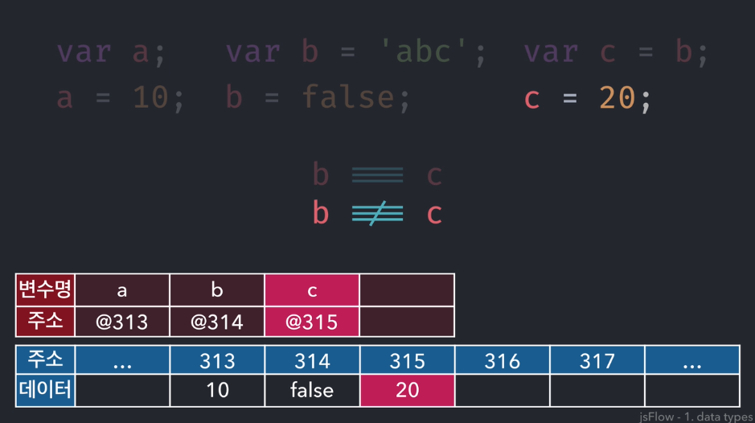
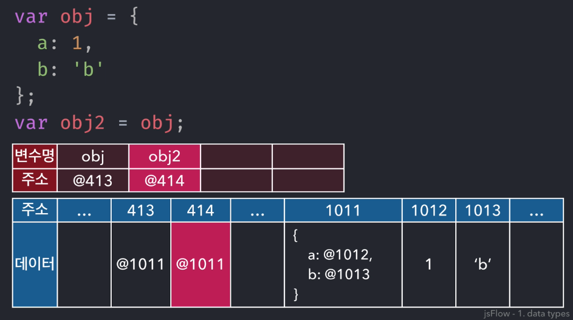
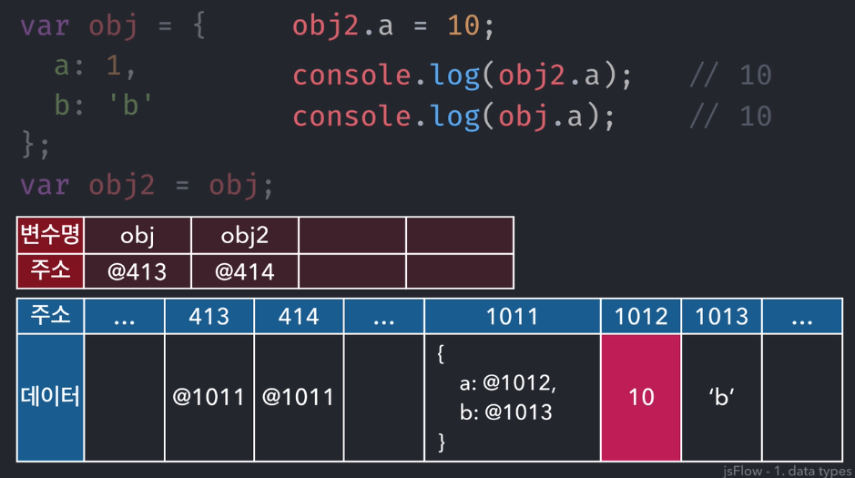
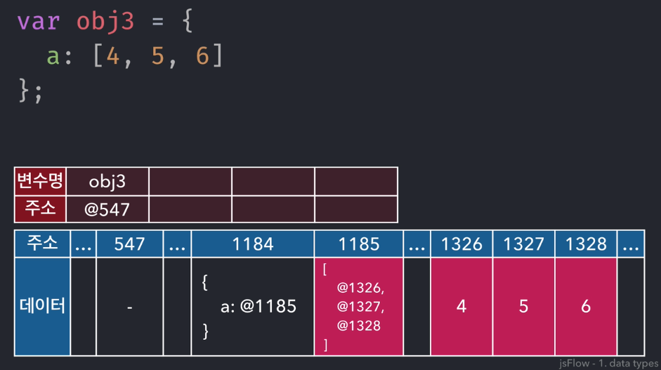
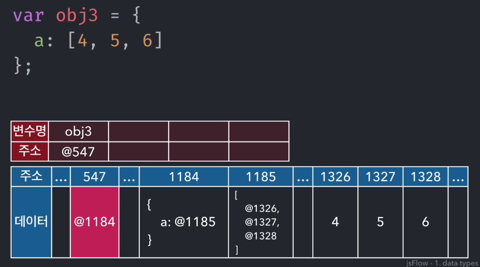
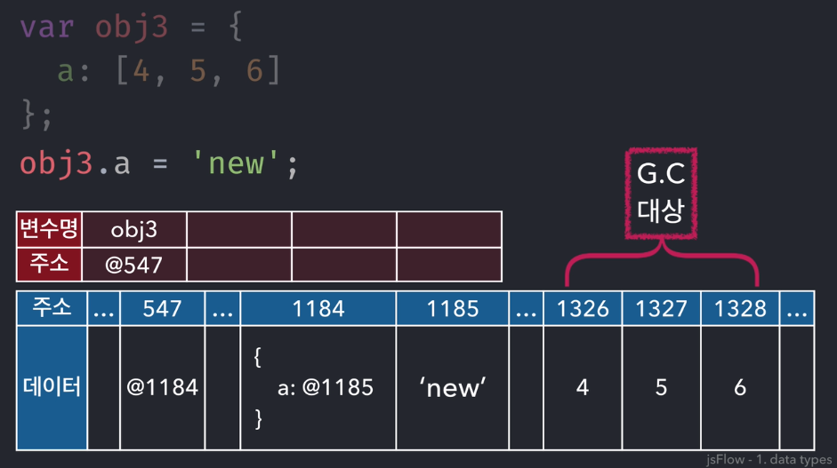

JavaScript 핵심 개념 알아보기 - 정재남
=====
[인프런 강의](https://www.inflearn.com/course/%ED%95%B5%EC%8B%AC%EA%B0%9C%EB%85%90-javascript-flow#)를 듣고 관련 내용을 기록한다.
- - -
## 목차
1. [요약](#요약)
	* [데이터 타입](#데이터-타입)
	* [Function](#Function)
	* [this](#this)
	* [클로저](#클로저)
	* [prototype](#prototype)
	* [Class](#Class)
2. [참고](#참고)

## 요약

이 강의는 자바스크립트 학습자들이 어렵게 느끼는 부분들에 대해 그 원리를 간략히 훑어봄으로써 향후 학습을 돕는데 그 목적이 있다. 말 그대로 흐름을 파악하는 데 그 목적이 있으므로 이후 상세히 각 내용을 공부할 필요가 있다. 따라서 다음은 다루지 않는다.

* 변수 선언 방식
* 반복문과 조건문
* 데이터 타입별 기본적인 메소드들
* 형변환 및 연산자, 표현식 등
* ES6 및 이후 최신

### 데이터 타입
> 데이터가 메모리에 저장되는 방식을 확인함으로써 기본형과 참조형의 차이가 생기는 이유를 살펴봄
- - -
자바스크립트의 두 가지 데이터 타입에 대해 살펴본다.
* 분류
	* Primitive type
		* Number, String, Boolean, null, undefined
		* ES6, Symbol 추가
	* Reference type
		* Object(Array, Function, RegExp)
		* ES6, Map/Set/WeakMap/WeakSet 추가
* 차이점
	* Primitive type: 값을 그대로 할당
	* Reference type: 값이 저장된 주소값을 할당(참조)
* 변수가 실제 메모리상에 저장되는 원리
	* Primitive type
		* 단계
			1. 데이터가 담길 공간을 확보
			2. 확보된 데이터의 주소값을 가지고 변수명과 매칭: 선언
			3. 다시 매칭된 주소가 가리키는 곳으로 이동해서 데이터를 저장: 할당
		* 도식화  
			 
			* 변수에 저장되는 값(ex. 'abc', false, 20)이 변하는 것이 아님
	* Reference type
		* 단계: 선언 과정은 같으나 할당 과정이 기본형과 다름
			1. 할당 과정에서 공간에 값을 할당하려고 보니 값이 기본형이 아닌 참조형임
			2. 참조형 데이터는 키와 밸류의 쌍으로 이루어져 있는데, 이는 변수명과 실제 데이터가 주소값으로 연결되어 있는 것과 비슷함
			3. 이후 과정은 아래 도식화를 참조해서 이해하되, 정리하면 참조형 데이터는 기본형 데이터의 집합이라 볼 수 있음
		* 도식화  
			 
			 
			* obj2가 obj와 다른 새로운 객체를 만든 것이 아니라 원래 obj가 바라보던 객체를 함께 바라보고 있음
			* 즉, obj와 obj2는 완전히 동일한 객체를 참조(obj ≡ obj2)
		* Nested한 객체: 참조형 데이터 안에 참조형 데이터가 있는 경우  
			 
			 
			 
	* 추가
		* 깊은 복사와 얕은 복사
		
##### [목차로 이동](#목차)

### Function
> 1. 호이스팅  
> 2. 함수선언문과 함수 표현식  
> 3. 함수스코프와 실행컨텍스트(자바스크립트 엔진이 해석하는 순서)  
> 4. 메소드와 함수의 차이  
> 5. 콜백함수의 정의 및 특징
- - -

##### [목차로 이동](#목차)

### this
> 상황별로 달라지는 this와 명시적인 this 바인딩 방법(세 가지)
- - -

##### [목차로 이동](#목차)

### 클로저
> 클로저의 의미  
> 클로저로 private 멤버 만들기
- - -

##### [목차로 이동](#목차)

### prototype
> prototype, constructor, _proto_  
> 메소드 상속 및 동작 원리  
> prototype chaining
- - - 

##### [목차로 이동](#목차)

### Class
> class란?  
> class 다중상속 구현하기
- - -

##### [목차로 이동](#목차)

## 참고

##### [목차로 이동](#목차)