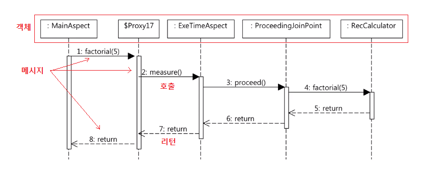
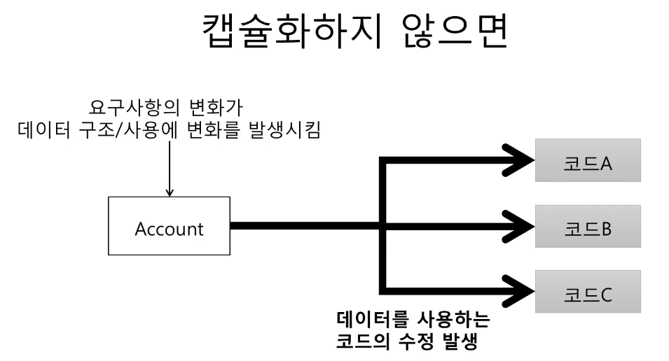
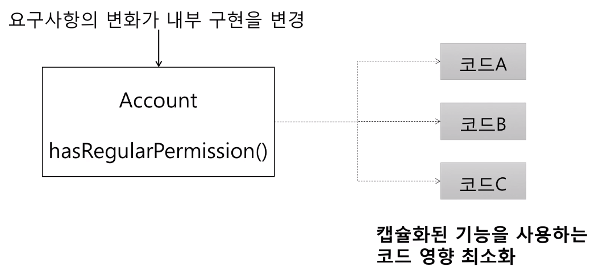
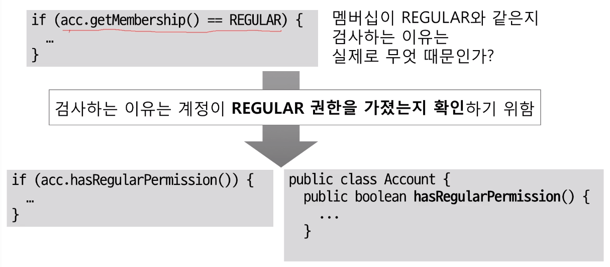
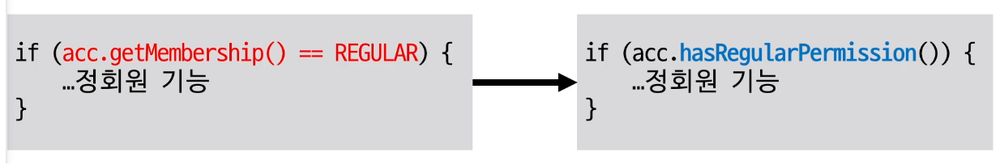
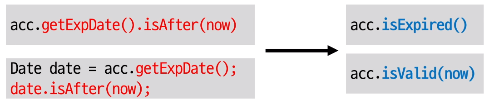
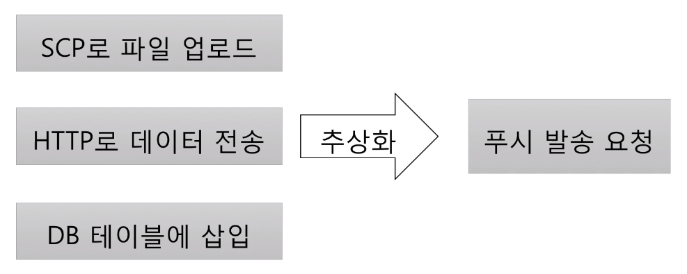
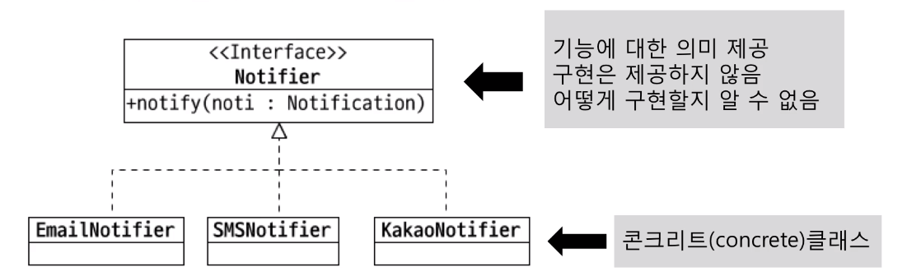

객체지향 프로그래밍 입문 - 최범균
=====
[인프런 강좌](https://www.inflearn.com/course/%EA%B0%9D%EC%B2%B4-%EC%A7%80%ED%96%A5-%ED%94%84%EB%A1%9C%EA%B7%B8%EB%9E%98%EB%B0%8D-%EC%9E%85%EB%AC%B8/)를 듣고 내용을 정리한다.  
최범균, madvirus@madvirus.net
- - -
## 목차
1. [요약](#요약)
	* [들어가며](#들어가며)
	* [객체](#객체)
	* [추상화](#추상화)
	* [상속보단 조립](#상속보단-조립)
	* [기능과 책임 분리](#기능과-책임-분리)
	* [의존과 DI](#의존과-DI)
	* [정리](#정리)
	* [부록](#부록)
2. [참고](#참고)

## 요약

### 들어가며
* 비용 증가
	* x-axis: Major release
	* y-axis
		* Cost/LOC(Lines of Code): x^2
		* Product Size(KLOC): x^1/2
* 원인
	* 버전 업데이트
		* 초기  
			```java
			long start = System.currentTimeMillis();
			// ...
			long end = System.currentTimeMillis();
			long elapsed = end - start;
			```
		* 변경  
			```java
			long start = System.nanoTime();
			// ...
			long end = System.nanoTime();
			long elapsednano = end - start;
			```
	* 조건 추가
		* 초기  
			```java
			int mode = 10;
			if(mode == 10) {
				// ...
			}
			
			if(mode != 10) {
				// ...
			}
			```
		* 변경  
			```java
			int mode = 10;
			if(mode == 10) {
				// ...
				if(조건) {
					mode = 20;
				}
				// ...
			}
			
			if(mode != 10) {
				// ...
			}
			```
			* 이 경우 변경된 코드 때문에 아래 if문이 실행되는 문제가 있음
				* 코드 분석 및 변경 시간 증가
			* if문 2개를 사용하는 것보다 if-else문을 사용하는 것이 낫다고 판단됨
* 소프트웨어의 가치: 변화  
	> Software maintenance is not "keep it working like before".  
	> It is "keep being useful in a changing world".
* 비용과 변화
	* 낮은 비용으로 변화할 수 있어야 함
	* 해결방안
		* 패러다임
			* 객체지향, 함수형, 리액티브, ...
		* 코드, 설계, 아키텍처
			* DRY, TDD, SOLID, DDD, ...
			* 클린 아키텍처, MSA, ...
		* 업무 프로세스/문화
			* 애자일, DevOps, ...
	* 이 중 **객체지향**이 비용을 낮춰주는 방법
		* 캡슐화 + 다형성(추상화)
				
##### [목차로 이동](#목차)
		
### 객체
* 절차지향 vs 객체지향
	* 개념
		* 절차지향: 데이터를 여러 프로시저가 공유하는 방식
		* 객체지향
			* 데이터와 프로시저를 객체라는 단위로 묶는 방식
			* 특정 객체가 갖고 있는 데이터는 그 객체의 프로시저만 접근할 수 있도록 함
				* 따라서 다른 객체에서는 해당 객체의 데이터에 바로 접근 불가
				* 이것이 **캡슐화**이고, 시간이 지나도 유지봏수(변경)가 쉬운 이유
			* 객체는 프로시저를 이용해 외부에 기능을 제공함
				* 즉 객체와 객체는 다른 객체의 프로시저를 호출하는 방식으로 서로 상호작용
	* 비교
		* 시간이 흘러갈수록 데이터를 공유하는 방식(절차지향)은 유지보수가 힘듦
			* 절차지향과 비용
				* 초기  
					```java
					// 인증 API
					Account account = findOne(id);
					if(account.getState() == DELETED) {
					
					}
					
					// 암호 변경 API
					Account account = findOne(id);
					if(account.getState() == DELETED) {
					
					}
					```
					* 인증 API 코드와 암호 변경 API 코드에서 state 데이터(상태)를 공유하고 있음
				* 시간이 지남에 따라 변경된 코드  
					```java
					Account account = findOne(id);
					if(account.getState() == DELETED || 
						account.getBlockCount() > 0 ||
						account.getEmailVerifyStatus() == 0) {
					
					}
					
					// 암호 변경 API
					Account account = findOne(id);
					if(account.getState() == DELETED || 
						account.getBlockCount() > 0 ||
						account.getActiveStatus() == ENABLE) {
					
					}
					```
					* 개선점
						* 조건을 변수로 정의함으로써 가독성 향상
						* 객체지향적으로 리팩토링함으로써 유지보수 수월하게 수정
* 객체
	* 객체의 핵심 → 기능 제공
		* 객체는 제공하는 기능으로 정의(객체를 사용하는 입장에서 생각)
		* 내부적으로 가진 필드(데이터)로 정의하지 않음
	* 예
		* 회원 객체
			* 암호 변경하기 기능
			* 차단 여부 확인하기 기능
		* 소리 제어기 객체
			* 소리 크기 증가하기 기능
			* 소리 크기 감소하기 기능
	* 기능 명세
		* 제공하는 기능을 어떻게 사용하는지 알려주는 것
			* cf. [메서드 시그니처](https://github.com/nara1030/ThisIsJava/blob/master/docs/etc/polymorphism.md)
		* 메서드(오퍼레이션)를 이용해서 기능 명세
			* 이름, 파라미터, 결과로 구성
		* 예
			* 회원 객체  
				```java
				public class Member {
					public void changePassword(String curPw, String newPw) {
						// ...
					}
				}
				```
			* 소리 제어기 객체  
				```java
				public class VolumeController {
					public void increase(int inc) {
						// ...
					}
					
					public void decrease(int dec) {
						// ...
					}
					public int volume() {
						// ...
					}
				}
				```
	* 객체와 객체
		* 객체와 객체는 기능을 사용해서 연결
			* 기능 사용 = 메서드 호출
		* 예  
			```java
			VolumeController volCont = new VolumeController();
			volCont.increase(4);
			volCont.decrease(3);
			int currentVol = volCont.volume();
			```
		* 용어: 메시지
			* 객제지향에서 종종 사용하는 용어
			* 객체와 객체 상호작용: **메시지**를 주고 받는다고 표현
				* 메서드를 호출하는 메시지, 리턴하는 메시지, 익셉션 메시지
			* 다이어그램  
				</br>
		* 객체?
			* 데이터에 접근하는 것 외에 특별한 기능이 없는 클래스  
				```java
				public class Member {
					private String name;
					private String id;
					
					public void setName(String name) {
						this.name = name;
					}
					
					public String getName() {
						return name;
					}
					
					public void setId(String id) {
						this.id;
					}
					
					public String getId() {
						return id;
					}
				}
				```
			* 객체라기보단 **데이터**에 더 가까움
				* 데이터 클래스, 구조체라는 표현도 사용
* 캡슐화(Encapsulation)
	* 두 가지 개념 포함
		* 데이터 + 관련 기능 묶기
		* 객체가 기능을 어떻게 구현했는지 외부에 감추는 것
			* 구현에 사용된 데이터의 상세 내용을 외부에 감춤
				* 결과적으로 외부(사용하는 코드)에 영향 없이(또는 최소화) 객체 내부 구현 변경 가능
			* 정보 은닉(Information Hiding) 의미 포함
	* 필요성
		* 캡슐화하지 않는다면
			* 초기  
				```java
				if(acc.getMembership() == REGULAR && acc.getExpDate().isAfter(now())) {
					// 정회원 기능
				}
				```
			* 변경  
				```java
				// 5년 이상 사용자
				// 일부 기능 정회원 혜택 1개월 무상 제공
				if(acc.getMembership() == REGULAR &&
					(
						(acc.getServiceDate().isAfter(fiveYearAgo) && acc.getExpDate().isAfter(now())) ||
						(acc/getServiceDate().isBefore(fiveYearAgo) && addMonth(acc.getExpDate()).isAfter(now()))
					)
				) {
					// 정회원 기능
				}
				```
			* 결론  
				</br>
				* 요구사항 변경 예
					* 장기 사용자에게 특정 기능 실행 권한을 연장(단, 유효 일자는 그대로 유지)
					* 계정을 차단하면 모든 실행 권한 없음
					* Date를 LocalDateTime으로 변경
		* 캡슐화 한다면
			* 기능을 제공하고 구현 상세를 감춤
			* 초기
				* 사용 클래스  
					```java
					if(acc.hasRegularPermission) {
						// 정회원 기능
					}
					```
				* 제공(구현) 클래스  
					```java
					public class Account {
						private Membership membership;
						private Date expDate;
						
						public boolean hasRegularPermission() {
							return membership == REGULAR && expDate.isAfter(now());
						}
					}
					```
			* 변경
				* 사용 클래스: 내부 구현만 변경  
					```java
					if(acc.hasRegularPermission()) {
						// 정회원 기능
					}
					```
				* 제공(구현) 클래스  
					```java
					public class Account {
						public boolean hasRegularPermission() {
							return membership == REGULAR &&
								( expDate.isAfter(now()) ||
									(
										serviceDate.isBefore(fiveYearAgo()) &&
										addMonth(expDate).isAfter(now())
									)
								);
						}
					}
					```
			* 결론
				* 캡슐화는 연쇄적인 변경 전파를 최소화  
				</br>
	* 장점 혹은 규칙
		* 캡슐화와 기능: 캡슐화 시도 → 기능에 대한 (의도) 이해를 높임  
			</br>
		* 캡슐화를 위한 규칙
			* Tell, Don't ask
				* 데이터 달라 하지 말고 (데이터를 갖고 있는 객체에게) 해달라고 하기  
				</br>
			* Demeter's Law
				* 메서드에서 생성한 객체의 메서드만 호출
				* 파라미터로 받은 객체의 메서드만 호출
				* 필드로 참조하는 객체의 메서드만 호출  
				</br>
* 캡슐화 예제
	* .
				
##### [목차로 이동](#목차)

### 추상화
* 다형성과 추상화
	* 다형성(Polymorphism)
		* 개념
			* 여러(poly) 모습(morph)을 갖는 것
			*  객체 지향에서는 한 객체가 여러 타입을 갖는 것
				* 즉 한 객체가 여러 타입의 기능을 제공
				* 타입 상속으로 다형성 구현(하위 타입은 상위 타입도 됨)
		* 예
			* 부모 클래스  
				```java
				public class Timer {
					public void start() { ... }
					public void stop() { ... }
				}
				
				public interface Rechargeable {
					void charge();
				}
				```
			* 자식(구현) 클래스  
				```java
				public class IotTimer extends Timer implements Rechargeable {
					public void charge() {
						// ...
					}
				}
				```
			* 사용 클래스  
				```java
				IotTimer it = new IotTimer();
				it.start();
				it.stop();
				
				Timer t = it;
				t.start();
				t.stop();
				
				Rechargeable r = it;
				r.charge();
				```
	* 추상화(Abstraction)
		* 데이터나 프로세스 등을 의미가 있는 비슷한 개념이나 의미 있는 표현으로 정의하는 과정
		* 분류: 두 가지 방식의 추상화
			* 특정한 성질
				* DB의 USER 테이블 → 아이디, 이름, 이메일
				* Money 클래스 → 통화, 금액
			* 공통 성질(일반화)
				* HP MXXX, 삼성 SL-M2XXX → 프린터
				* 지포스, 라데온 → GPU
		* 다형성: 위 분류 중 공통 성질을 뽑아내는 추상화와 관련
			* 다형성은 서로 다른 구현(의 공통 성질을) 추상화  
				</br>
			* 타입 추상화
				* 여러 구현 클래스를 대표하는 상위 타입 도출
					* 흔히 인터페이스 타입으로 추상화
					* 추상화 타입과 구현은 타입 상속으로 연결  
				</br>
				* 추상 타입 사용

##### [목차로 이동](#목차)

### 상속보단 조립

##### [목차로 이동](#목차)

### 기능과 책임 분리

##### [목차로 이동](#목차)

### 의존과 DI

##### [목차로 이동](#목차)

### 정리

##### [목차로 이동](#목차)

### 부록

##### [목차로 이동](#목차)

## 참고
* [개발자 치즈님의 강의 요약 정리](https://github.com/cheese10yun/TIL/blob/master/OOP/%EA%B0%9D%EC%B2%B4-%EC%A7%80%ED%96%A5-%ED%94%84%EB%A1%9C%EA%B7%B8%EB%9E%98%EB%B0%8D-%EC%9E%85%EB%AC%B8.md)

##### [목차로 이동](#목차)