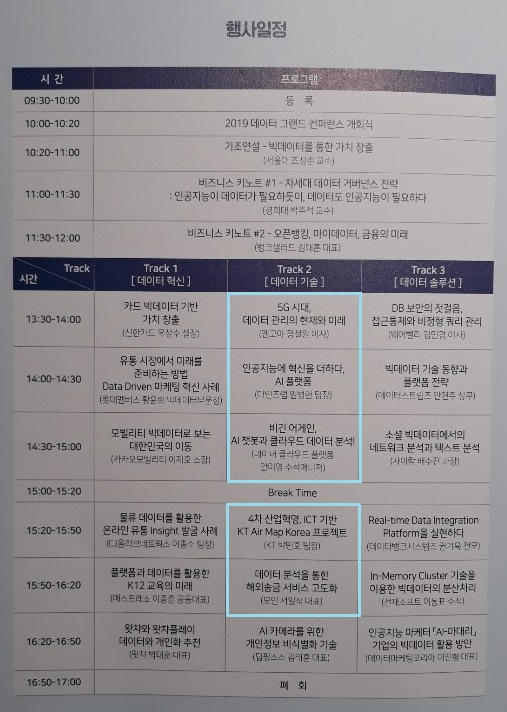
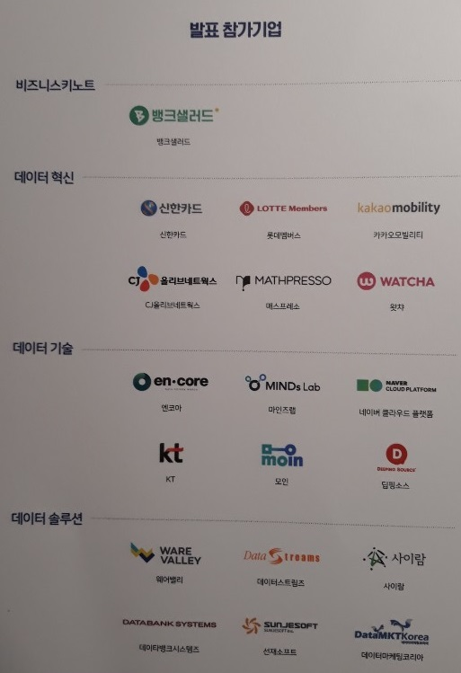

2019 데이터 그랜드 컨퍼런스
=====
데이터로 만들어가는 대한민국의 미래

* 일시: 2019.11.27(수), 10:00 ~ 17:00
* 장소: 서울드래곤시티 5층 그랜드볼룸 백두홀
- - -
## 목차
1. [행사일정](#행사일정)
2. [정리](#정리)
3. [참고](#참고)
	* [발표 참가기업](#발표-참가기업)

## 행사일정
 

##### [목차로 이동](#목차로-이동)

## 정리
추후 정리

* [2019 발표 자료](https://dgcon.symflow.com/)
* [2019 이전 발표 자료](https://www.dqc.or.kr/grand_conference/conference_data/)

##### [목차로 이동](#목차로-이동)

## 참고
### 발표 참가기업
~~잘 안 보이면 확대해서 보면 됨~~

 

##### [목차로 이동](#목차로-이동)