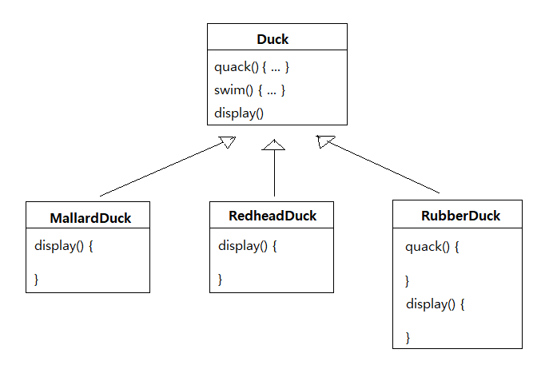
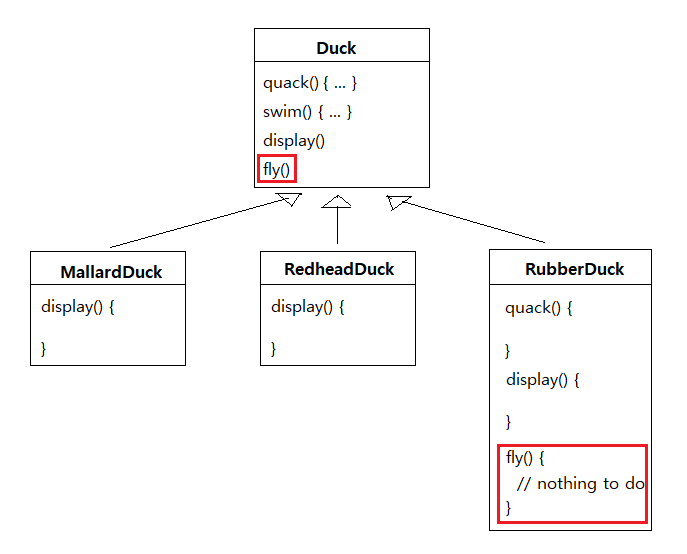
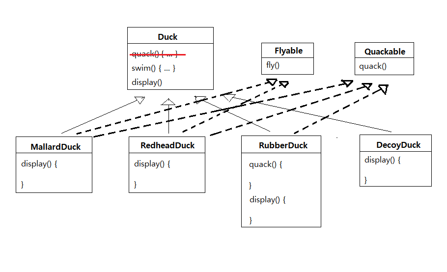
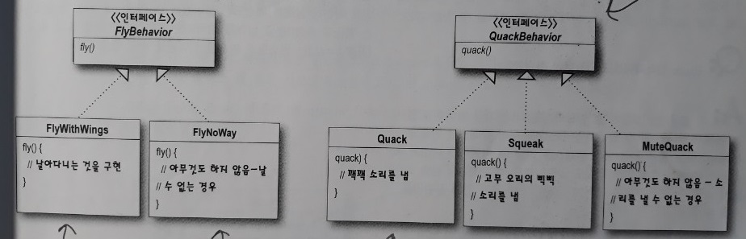

1주차 - Strategy Pattern
=======
2019.09.21: 스트레티지 패턴, 즉 전략패턴
- - - -
## 목차
1. [예제](#예제)
	* [초기버전](#초기버전)
	* [상속](#상속)
	* [구현](#구현) 
	* [캡슐화로 유연성 향상](#캡슐화로-유연성-향상)
		* [바뀌는 부분 분리하기](#바뀌는-부분-분리하기)
2. [기타](#기타)
	* 인터페이스
	* super 금지
	* 디자인 패턴이란
3. [참고](#참고)

## 예제
### 초기버전
아래는 `오리 연못 시뮬레이션 게임`의 초기 버전이다.

 

수퍼 클래스(추상 클래스)에서 오리의 필수 행동(`quack()`, `swim()`)을 구현(`display()` 제외)한 후 이를 자식 클래스(구상 클래스)에서 재사용 혹은 오버라이딩해서 사용한다.

##### [목차로 이동](#목차)

### 상속
`오리들이 날아다닐 수 있도록 해`라는 요청사항(변경사항)이 들어왔다. 이 요청에 대해 부모 클래스에 `fly()` 메소드를 정의함으로써 하위 클래스가 그것을 상속받도록 설계할 수 있다.

 

하지만 이 경우 `모든 서브 클래스가 날 수 있는 것은 아니다`라는 문제가 있다. 즉, 이렇게 설계한다면 일부 서브 클래스에 적합하지 않은 행동이 추가된 것이다. 물론 `아무 것도 하지 않도록 오버라이드하면 되지 않느냐` 반론이 가능하다(`quack() 메소드에서 이미 그랬던 것처럼`). 하지만 상속을 이용한 설계에는 아래와 같은 단점이 존재할 수 있다.

* 서브 클래스에서 코드가 중복된다.
* 실행시에 특징을 바꾸기 힘들다.
	* 컴파일 타임에 행동이 특정된다.
* 모든 오리의 행동을 알기 힘들다.
	* 위의 `fly()` 메소드처럼 부모 클래스를 통해 구체 클래스를 특정할 수 없다.
* 코드를 변경했을 때 다른 오리들한테 원치 않은 영향을 끼칠 수 있다.

##### [목차로 이동](#목차)

### 구현
상속의 경우, 변경사항이 생길 때마다 Duck의 서브 클래스의 `fly()`와 `quack()` 메소드를 일일이 살펴봐야 하고, 상황에 따라 오버라이드해야 한다.

결국 (전체가 아닌) 일부 형식의 오리만 날거나 꽥꽥거릴 수 있도록 하는 더 깔끔한 방법을 찾아야 한다.

 

하지만 이 경우도 역시 코드 중복이라는 단점이 존재한다. 고무 오리가 날아다니는 것과 같은 이상한 일은 방지할 수 있지만 코드의 재사용을 전혀 기대할 수 없게 된다.

##### [목차로 이동](#목차)

### 캡슐화로 유연성 향상
소프트웨어 개발에 있어서 절대로 바뀌지 않는 것이 뭘까? 바로 변화이다. 바로 이 상황에서 어울리는 디자인 원칙이 있다.

> 애플리케이션에서 달라지는 부분을 찾아내고, 달라지지 않는 부분으로부터 분리시킨다.

이는 다시 말해, 바뀌는 부분은 따로 뽑아서 캡슐화시키는 것이다. 그렇게 하면 나중에 바뀌지 않는 부분에는 영향을 미치지 않은 채로 그 부분만 고치거나 확장할 수 있다.

곁가지긴 하지만 `캡슐화 ≠ 정보은닉`라고 생각이 든다. 캡슐화는 코드를 변경하는 과정에서 의도하지 않은 일이 일어나는 것을 줄이면서 시스템의 유연성은 향상시킬 수 있게 한다.

##### [목차로 이동](#목차)

#### 바뀌는 부분 분리하기
지금까지 살펴본 바로는, `fly()`와 `quack()` 문제를 제외하면 Duck 클래스는 잘 작동하고 있으며, 나머지 부분은 자주 달라지거나 바뀌지 않는다. 즉 `fly()`와 `quack()`은 Duck 클래스에서 오리마다 달라지는 부분이다. 이러한 행동을 Duck 클래스로부터 갈라내기 위해서 그 두 메소드를 모두 Duck 클래스로부터 끄집어내서 각 행동을 나타낼 클래스 집합을 새로 만들도록 한다.

그렇다면 `나는 행동`과 `꽥꽥거리는 행동`을 구현하는 클래스 집합을 어떻게 디자인해야 할까? 두 가지 고려사항이 있다.

* 최대한 유연하게 만들어야 함(`캡슐화`)
* Duck의 인스턴스에 행동을 할당할 수 있어야 함
	* 초기화
	* 프로그램 실행 중 변경(`setter 메소드`)

 

##### [목차로 이동](#목차)

## 기타

##### [목차로 이동](#목차)

## 참고

##### [목차로 이동](#목차)