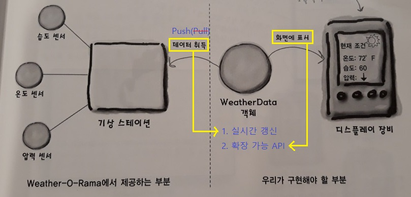
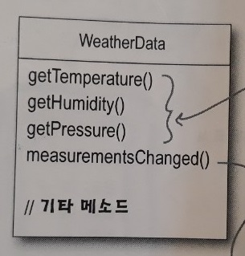
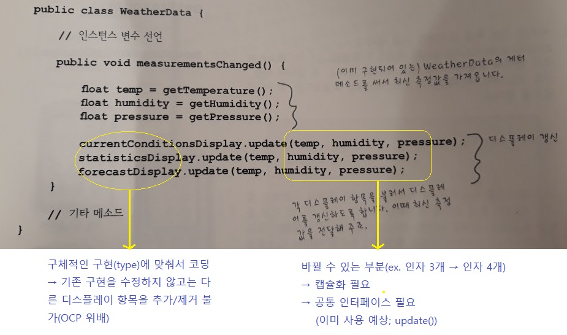
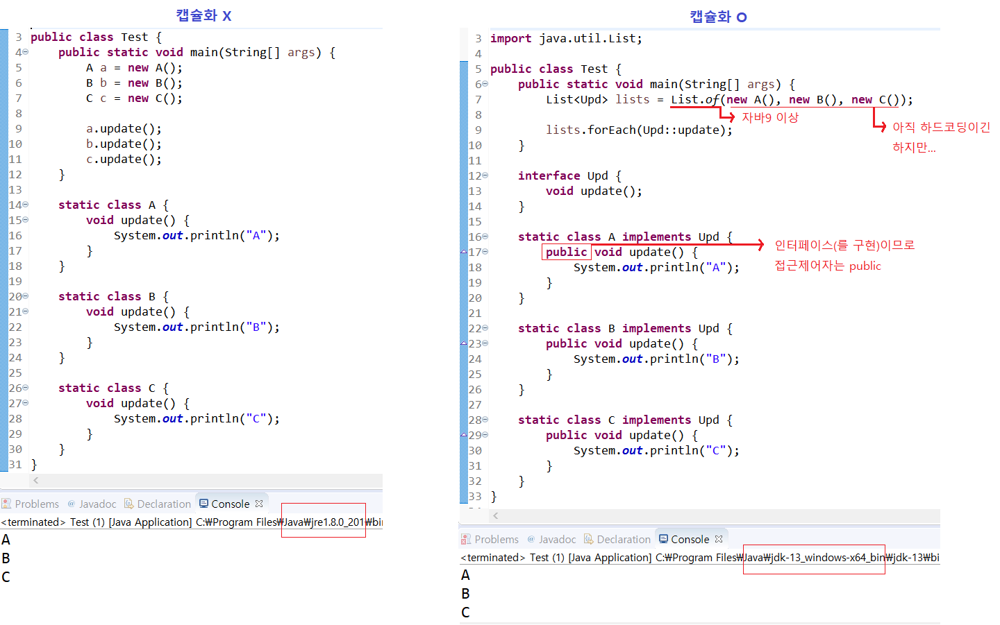
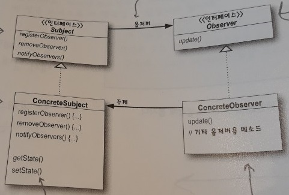
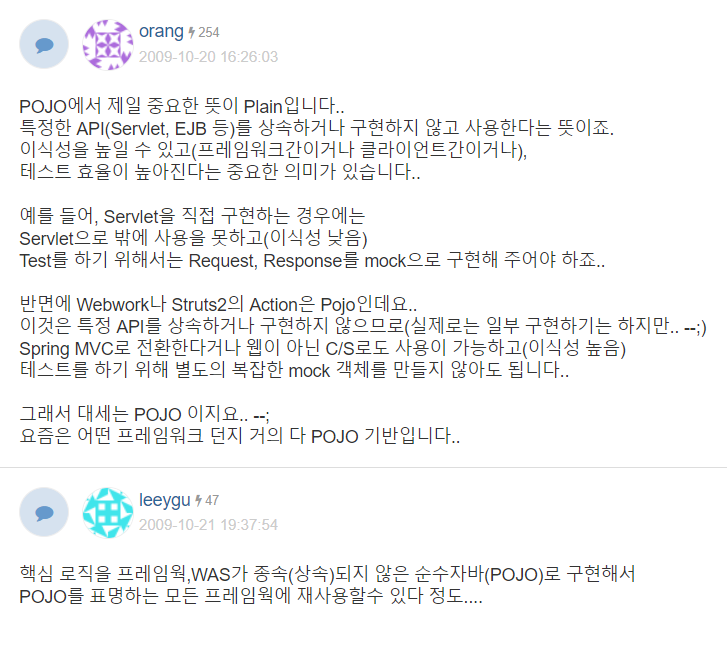

2주차 - Observer Pattern
=======
2019.09.28: 옵저버 패턴, ~~데코레이터 패턴~~  
1주차 때 시간이 남아 두 단원을 나갈 수도 있다고 공지받았으나, 남은 1시간 동안 자바 관련 내용(`POJO`, `Generics`)에 대해 배움  
두 번 참석했지만 멀리까지 가서 듣는 보람이 있을만큼 지식뿐 아니라, 강의자의 정성이 느껴지는 좋은 스터디인데 일정때매 두 번 빠지게 되는 게 아쉽지만 뭐, 쩝
- - - -
## 목차
1. [옵저버 패턴](#옵저버-패턴)
	* [Rxjava](#Rxjava)
	* [예제](#예제)
		* [요구사항](#요구사항)
		* [개략적인 코드](#개략적인-코드)
	* [개념](#개념)
		* [정의](#정의)
		* [클래스 다이어그램](#클래스-다이어그램)
	* [예제 완성 코드](#예제-완성-코드)
		* [추가 구현 사항](#추가-구현-사항)
	* [자바 내장 옵저버 패턴](#자바-내장-옵저버-패턴)
2. [자바 관련]
	* [POJO](#POJO)
		* [스프링과 POJO](#스프링과 POJO)
	* [Generics](#Generics)
3. [기타](#기타)
	* +, -
	* [참고](#참고)

## 옵저버 패턴
### Rxjava
~~제대로 들었는지 모르겠는데~~ 옵저버 패턴을 대체하는 개념으로 `Rxjava`를 소개했다. 요즘은 옵저버 패턴이 많이 쓰이지 않는다고 했다.

옵저버 패턴은 주로 `UI Programming`에 많이 쓰인다고 했다. `이벤트 주도 개발`에 사용된다고 들었다. 이 부분은 더 살펴봐야 한다.

##### [목차로 이동](#목차)

### 예제
`Weather-O-Rama` 사의 차세대 `인터넷 기반 기상 정보 스테이션` 구축 프로젝트를 귀하의 그룹에서 수행하게 되었음을 알려드립니다.

#### 요구사항
> 기상 정보 스테이션은 저희 회사에서 현재 특허 출원중인 WeatherData 객체를 바탕으로 만들어질 것입니다. 이 객체는 현재 기상 조건(기온, 습도, 기압)을 `추적하는 객체`입니다. 기본적으로 세 개의 항목을 화면에 표시하는 애플리케이션을 만들어 주시기 발바니다. 이 세 항목은 모두 WeatherData 객체에서 최신 측정치를 수집할 때마다 `실시간으로 갱신`됩니다.

> 그리고 이 스테이션은 `확장 가능한` 스테이션입니다. 저희 회사에서는 다른 개발자들이 직접 날씨 표시 장치를 만들고 거기에 우리 회사에서 개발한 것을 그대로 가져다 쓸 수 있도록 API를 발표할 예정입니다.

</br>

##### [목차로 이동](#목차)

#### 개략적인 코드
다음은 발주사인 `Weather-O-Rama`가 보내온 `WeatherData` 객체의 규격이다.

</br>

위를 정리해보면 아래와 같다.

* 변수들(`temperature`, `humidity`, `pressure`)의 설정 방법(`setter`)은 신경쓸 필요가 없음
	* 기상 스테이션에서 갱신된 정보를 가져오는 것은 WeatherData에서 알아서`(?)` 해줌 
* `measurementsChanged()`가 기상 관측값이 갱신될 때마다 알려주기 위한 메소드
	* 우리(`수주 업체`)가 추가해야 될 부분

이를 바탕으로 개략적인 코드를 구현할 수 있다.

</br>

코드를 보면 update()의 `메소드 시그니처`가 같음을 확인할 수 있다. 이는 쉽게 말해 메서드 오버로딩이 되는 기준이다(`접근 제어자`, `반환 타입`는 해당 안되므로 메소드 선언부 아님). 즉 `캡슐화`, 인터페이스를 추출해 `유연성을 확보`할 필요가 있다(인터페이스 추출 여부는 이 코드만으로는 확인 불가). 관련 예는 아래와 같다.

</br>

##### [목차로 이동](#목차)

### 개념

#### 정의
옵저버 패턴은 `신문사`와 `정기구독자`로 이루어지는 신문 구독 서비스에 비유해서 생각하면 된다. 보통 다음과 같이 정의된다.

> 옵저버 패턴에서는 한 객체의 상태가 바뀌면 그 객체에 의존하는 다른 객체들한테 연락이 가고 `자동으로 내용이 갱신`되는 방식으로 `일대다(one-to-many)` 의존성을 정의한다.

여기서 `의존(성)`이라는 개념을 이해해야 하는데, 주제 인터페이스와 옵저버 인터페이스가 들어있는 클래스 디자인을 바탕으로 살펴본다. 참고로 인터페이스 `구현`, 클래스 `상속` 모두 의존의 하나다.

##### [목차로 이동](#목차)

### 클래스 다이어그램
</br>

위 클래스 다이어그램에서 두 가지 생각을 했다.

* 의존성 방향(의존 관계)
	* `Subject` → `Observer`
		* 상태가 없는 인터페이스간의 의존 관계가 어떻게 성립하는가
		* `registerObserver()`와 `removeObserver()`의 인자로 `Observer` 타입이 들어감(즉, 해당 클래스(`타입`)를 `import`해야 함을 의미)
	* `ConcreteSubject` ← `ConcreteObserver`
		* 구독자가 직접 구독 해제하기 위해 `ConcreteSubject 타입(Subject X)`를 인스턴스 필드로 소유
* 이 관계는 `양방향 연관관계`인가?
	* 안 좋은 거 아닌가 하는 생각이 들어 물어보았는데, `그렇게 볼 수도 있다`는 답변을 들음

##### [목차로 이동](#목차)

### 예제 완성 코드
완성 코드는 [링크](./src/observer_pattern)를 클릭하면 확인할 수 있다. 예제 코드에서 생각했던 점은 아래와 같다.

* 컬렉션 선언 시 제네릭 필수  
	```java
	private ArrayList observers; 	// x
	
	private ArrayList<Observer> observers; // o
	```
	* 책에서 `WeatherData` 클래스에서 Observer 리스트를 선언할 때 제네릭을 사용하지 않아 수정
* `List` vs. `Set`
	* WeatherData 클래스에서 List(`ArrayList` 클래스) 인터페이스를 이용해서 옵저버를 저장
	* 등록/삭제 시 인자로 `Observer` 객체를 받음
		* `등록` 시는 간단하지만, `삭제` 시 코드가 약간 조잡([코드 확인](./src/observer_pattern/server/concrete_/WeatherData.java))
		* `List` 대신 `Set`을 사용하면 어땠을까?
* `notifyObservers()`
	* `notify()`는 Observer에게 위임하고, WeatherData는 `제어(for문)`에 집중하는 것으로 이해

##### [목차로 이동](#목차)
	
#### 추가 구현 사항


### 자바 내장 옵저버 패턴
두 가지 방식을 구현할 수 있다.

* Push
	* .
* Pull
	* .

이 외에 생각해보아야 할 부분은 아래와 같다.

* `java.util.Observable`의 단점
	* .
* 패키지 구성
	* API 사용한 것과 사용하지 않은 것을 같이 사용하고 싶을 때 패키지 구성을 어떻게 해야 하는지 고민 필요

##### [목차로 이동](#목차)

## 자바 관련
### POJO
위에서 `java.util.Observable` 클래스를 상속(`확장`)해 주제 객체를 만들었다. 이 경우 발생하는 문제 중 하나가 재사용성에 제약이 걸린다는 점이다(이미 다른 수퍼클래스를 확장하고 있는 클래스에 Observable의 기능을 추가할 수 없기 때문). 이와 비슷한 예로 `Servlet`을 들 수 있다(`HttpServlet` 상속받음). 이처럼 개발자가 그 의미(`Is-a`)대로 사용한 경우가 아니라 프레임워크 기술을 구현하기 위해 `상속`을 써버린 경우, `POJO`가 아니게 된다.

`POJO`의 정의는 [다음](https://ko.wikipedia.org/wiki/Plain_Old_Java_Object)과 같은데, 스프링은 이를 위해 어노테이션을 도입했다고 한다(`Servlet` → `Spring MVC Controller`). 

#### 스프링과 POJO
OKKY에서 POJO에 대해 언급한 부분을 발췌한다.

</br>

추가로 다음 [링크](https://limmmee.tistory.com/8)를 확인하면 스프링에 대해 더 잘 이해할 수 있다.

##### [목차로 이동](#목차)

### Generics
[관련 자료](https://slides.com/changyong/generics#/)

##### [목차로 이동](#목차)

## 기타
### 참고
* [Observer pattern - LichKing](https://multifrontgarden.tistory.com/257?category=471239)
* Java 9
	* [변화와 특징 정리](https://medium.com/@goinhacker/java-9%EC%9D%98-%EB%B3%80%ED%99%94%EC%99%80-%ED%8A%B9%EC%A7%95-%EB%8C%80%EC%B6%A9-%EC%A0%95%EB%A6%AC-fca77cee88f2)
	* [불변 컬렉션 생성](https://www.daleseo.com/java9-immutable-collections/)
* [Guid to the Java 8 forEach](https://www.baeldung.com/foreach-java)
* [이클립스에서 자바 API 문서 확인하는 법](https://fors.tistory.com/112)

##### [목차로 이동](#목차)