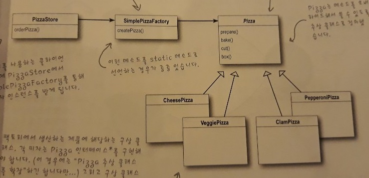
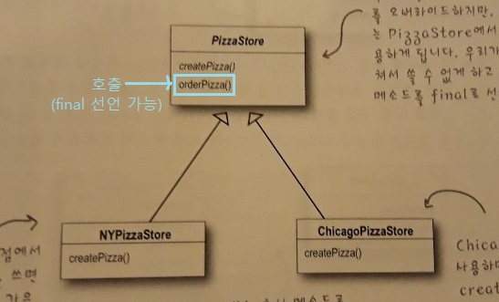

4주차 - Factory Method Pattern
=======
2019.10.19: 팩토리 메소드 패턴  
- - - -
## 목차
1. [팩토리 메소드 패턴](#팩토리-메소드-패턴)
	* [인터페이스와 구현부의 분리](#인터페이스와-구현부의-분리)
	* [객체 생성부 캡슐화](#객체-생성부-캡슐화)
	* [피자 가게 프레임워크](#피자-가게-프레임워크)
		* [팩토리 메소드](#팩토리-메소드)
		* [프레임워크 vs 라이브러리](#프레임워크-vs-라이브러리)
		* [오브젝트](#오브젝트)
	* [의존성 뒤집기 원칙](#의존성-뒤집기-원칙)
2. [기타](#기타)
	* [LocalDate](#LocalDate)
3. [참고](#참고)
	
## 팩토리 메소드 패턴
### 인터페이스와 구현부의 분리
`사용의 편리성`뿐 아니라 `코드 변경`의 관점에서 봤을 때도 [인터페이스(타입)와 구현부의 분리](https://github.com/nara1030/thinkingInJava/blob/master/docs/thinkingInJava_ch1.md), 즉 `캡슐화`는 필요하다.

한편 new 연산자를 이용해 `객체의 인스턴스를 만드는 작업`은 구현부다. 이 부분은 특정 클래스에 의존하므로 결합도가 높다고(ex. [전략 패턴 - 바뀌는 부분 분리하기 中 코드](https://github.com/nara1030/portfolio/blob/master/docs/study/designPattern/designPattern_week_1.md#%EB%B0%94%EB%80%8C%EB%8A%94-%EB%B6%80%EB%B6%84-%EB%B6%84%EB%A6%AC%ED%95%98%EA%B8%B0)) 할 수 있다. 따라서 이 부분을 따로 분리해(`캡슐화`) 불필요한 의존성을 없앨 필요가 있다(∴ OCP). 그리고 그것이 `팩토리 패턴`이다.

##### [목차로 이동](#목차)

### 객체 생성부 캡슐화
책의 예제인 `피자 가게`를 예로 들어본다.

* 레거시 - 피자 가게  
	```java
	Pizza orderPizza(String type) {
		Pizza pizza;
		
		// 객체 생성 코드 - 분리 필요(OCP)
		if (type.equals("cheese")) {
			pizza = new CheesePizza();
		} else if(type.equals("greek")) {
			pizza = new GreekPizza();
		} else if(type.equals("pepperoni")) {
			pizza = new PepperoniPizza();
		}
		
		pizza.prepare();
		pizza.bake();
		pizza.cut();
		pizza.box();
		return pizza;
	}
	```
* 변경 코드
	* 피자 생성 팩토리  
	```java
	public class SimplePizzaFactory {
		public Pizza createPizza(String type) {
			Pizza pizza = null;
			
			if (type.equals("cheese")) {
				pizza = new CheesePizza();
			} else if(type.equals("greek")) {
				pizza = new GreekPizza();
			} else if(type.equals("pepperoni")) {
				pizza = new PepperoniPizza();
			}
			return pizza;
		}
	}
	```
	* 피자 가게  
	```java
	public class PizzaStore {
		SimplePizzaFactory factory;
		
		public PizzaStore(SimplePizzaFactory factory) {
			this.factory = factory;
		}
		
		public Pizza orderPizza(String type) {
			Pizza pizza;
			
			// new 연산자 대신 팩토리 객체의 create 메소드 사용
			pizza = factory.createPizza(type);
			
			pizza.prepare();
			pizza.bake();
			pizza.cut();
			pizza.box();
			return pizza;
		}
	}
	```

위에서 보듯, 객체 생성을 처리하는 클래스를 `팩토리`라고 부른다. 일단 `SimplePizzaFactory`를 만들고 나면 orderPizza() 메소드는 새로 만든 객체의 클라이언트가 된다. 즉 새로 만든 객체를 호출한다. 이제 더 이상 orderPizza() 메소드에서 어떤 피자를 만들어야 하는지 고민하지 않아도 된다. orderPizza() 메소드에서는 Pizza 인터페이스를 구현하는 피자를 받아서 그 인터페이스에서 정의했던 prepare(), bake(), cut(), box() 메소드를 호출하기만 하면 된다.

한편 `PizzaStore`에 `SimplePizzaFactory`의 레퍼런스를 저장했다. 즉 `구성`을 활용했고 이는 런타임에 행동을 변경할 수 있음을 의미한다.

여기까지가 간단한 팩토리라고 할 수 있는데, 이는 패턴은 아니다.

</br>
	
##### [목차로 이동](#목차)

### 피자 가게 프레임워크
피자 가게(`PizzaStore`)가 큰 성공을 거둬 이를 타지역으로 확장하려 한다. 하지만 지역마다 다른 특성을 어떻게 반영할 수 있을까? 아래와 같은 방법을 생각해볼 수 있다.

```java
NYPizzaFactory nyFactory = new NYPizzaFactory();
PizzaStore nyStore = new PizzaStore(nyFactory);
nyStore.order("Veggie");

ChicagoPizzaFactory chicagoFactory = new ChicagoPizzaFactory();
PizzaStore chicagoStore = new PizzaStore(chicagoFactory);
chicagoStore.order("Veggie");
```

즉 `생성 과정`(Factory)과 `파는 과정`(Store)을 분리했기 때문에 가능한 방법이었다. 하지만 ~~만드는 과정 역시 프랜차이즈마다 다를 수 있다. 이때 피자를 파는(만드는: X) 활동 자체는 전부 `PizzaStore` 클래스에 국한시키면서도 분점마다 고유의 스타일을 살릴 수 있는 방법이 있다.~~ 이 경우 중복이 많이 생기게 된다.

```java
public abstract class PizzaStore {
	public Pizza orderPizza(String type) {
		Pizza pizza;
		
		pizza = createPizza(type);
		
		pizza.prepare();
		pizza.bake();
		pizza.cut();
		pizza.box();
		
		return pizza;
	}
	
	protected abstract Pizza createPizza(String type);
}
```

위에서 보듯 createPizza(), 즉 `객체 생성` 메소드를 `PizzaStore`에 다시 집어넣는다. 하지만 이번에는 이 메소드를 **추상 메소드**로 선언하고, 각 지역마다 고유의 스타일에 맞게 `PizzaStore`의 서브클래스를 만들도록 한다.

##### [목차로 이동](#목차)

#### 팩토리 메소드
`PizzaStore`의 orderPizza() 메소드에 이미 주문 시스템이 잘 갖춰져 있다. 이 주문 시스템 자체는 모든 분점에서 똑같이 진행되어야 한다. 각 분점마다 달라지는 것은 피자의 스타일 뿐이다. 즉 서브클래스에서 결정, 즉 책임지는 것은 createPizza() 메소드의 구현부이다.

</br>

위와 같은 설계라면 `PizzaStore` 프레임워크에 충실하면서도 각각의 스타일을 제대로 구현할 수 있는 orderPizza() 메소드를 가지고 있는 `PizzaStore` 서브 클래스들을 구비할 수 있다.

이때 Pizza 인스턴스를 만드는, 팩토리 역할을 하는 createPizza() 메소드를 `팩토리 메소드`라 부른다. 지금까지 살펴봤듯, 팩토리 메소드는 객체 생성을 처리하며 이를 이용하면 객체 생성 작업을 서브클래스에 캡슐화할 수 있다. 즉, 수퍼클래스에 있는 클라이언트 코드와 서브클래스에 있는 객체 생성 코드를 분리시킬 수 있다.

##### [목차로 이동](#목차)

#### 프레임워크 vs 라이브러리
위에서 예제 코드를 설명할 때 피자 가게 **프레임워크**라고 명명했다. 즉 `PizzaStore`가 프레임워크라는 얘기다. 프레임워크가 무엇인지, 라이브러리와 비교해 더 자세히 알아볼 수 있다.

> * 프레임워크: 내 코드**를** 호출
> * 라이브러리: 내 코드**가** 호출


`PizzaStore`의 orderPizza()는 추상 클래스인 `PizzaStore`에 정의되어 있다. 다시 말해 orderPizza() 메소드가 Pizza 객체를 가지고 여러 가지 작업을 하긴 하지만, `PizzaStore`는 추상 클래스이기 때문에 orderPizza()에서는 실제로 어떤 구상 클래스에서 작업이 처리되는지 알 수가 없다. 즉 `PizzaStore`와 `Pizza`는 서로 완전히 분리되어 있다.


##### [목차로 이동](#목차)

#### 오브젝트


##### [목차로 이동](#목차)

### 의존성 뒤집기 원칙

##### [목차로 이동](#목차)

## 기타
주제 외에 언급했던 부분을 간략하게 정리한다.

### 프레임워크 vs 라이브러리
* 프레임워크
	* `추상클래스`로 직접 누군가를 호출  
	(예로, 스프링의 컨트롤러가 누군가를 호출)
* 라이브러리
	* 프레임워크와 반대로 호출당하는 대상

##### [목차로 이동](#목차)

### LocalDate
* [왜 LocalDate, LocalTime 및 Stream 객체가 생성자 대신에 factory 메소드를 사용하는가?](https://codeday.me/ko/qa/20190610/760909.html)
* [java.time 패키지](https://programmers.co.kr/learn/courses/9/lessons/265)

##### [목차로 이동](#목차)

## 참고
* [프레임워크와 라이브러리의 차이점](https://webclub.tistory.com/458)

##### [목차로 이동](#목차)