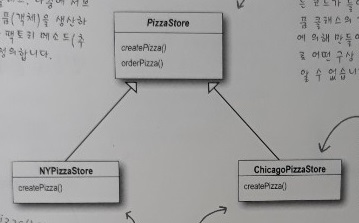
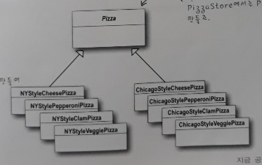
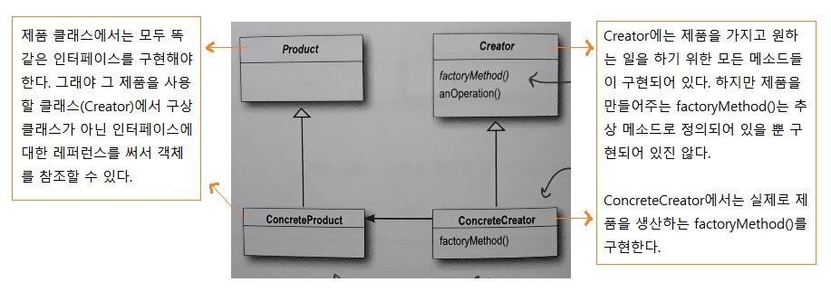
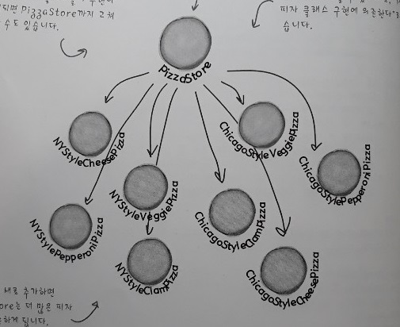
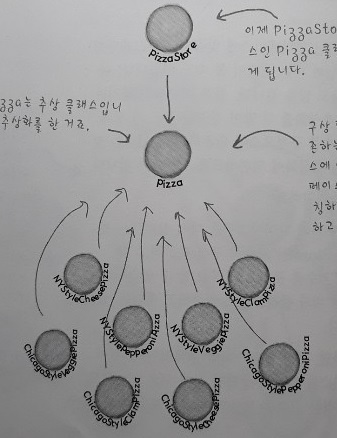

4주차 - Factory Method Pattern
=======
2019.10.19: 팩토리 메소드 패턴  
- - - -
## 목차
1. [팩토리 메소드 패턴](#팩토리-메소드-패턴)
	* [인터페이스와 구현부의 분리](#인터페이스와-구현부의-분리)
	* [객체 생성부 캡슐화](#객체-생성부-캡슐화)
	* [피자 가게 프레임워크](#피자-가게-프레임워크)
	* [생산자 클래스와 제품 클래스](#생산자-클래스와-제품-클래스)
		* [의존성 뒤집기 원칙](#의존성-뒤집기-원칙)
	* [전체 코드](#전체-코드)
	* [기타](#기타)
		* [코딩 가이드 라인](#코딩-가이드-라인)
		* [프레임워크 vs 라이브러리](#프레임워크-vs-라이브러리)
		* [팩토리 메소드와 템플릿 메소드](#팩토리-메소드와-템플릿-메소드)
2. [기타](#기타)
	* [LocalDate](#LocalDate)
3. [참고](#참고)
	
## 팩토리 메소드 패턴
### 인터페이스와 구현부의 분리
`사용의 편리성`뿐 아니라 `코드 변경`의 관점에서 봤을 때도 [인터페이스(타입)와 구현부의 분리](https://github.com/nara1030/thinkingInJava/blob/master/docs/thinkingInJava_ch1.md), 즉 `캡슐화`는 필요하다.

한편 new 연산자를 이용해 `객체의 인스턴스를 만드는 작업`은 구현부다. 이 부분은 특정 클래스에 의존하므로 결합도가 높다고(ex. [전략 패턴 - 바뀌는 부분 분리하기 中 코드](https://github.com/nara1030/portfolio/blob/master/docs/study/designPattern/designPattern_week_1.md#%EB%B0%94%EB%80%8C%EB%8A%94-%EB%B6%80%EB%B6%84-%EB%B6%84%EB%A6%AC%ED%95%98%EA%B8%B0)) 할 수 있다. 따라서 이 부분을 따로 분리해(`캡슐화`) 불필요한 의존성을 없앨 필요가 있다(∴ OCP). 그리고 그것이 `팩토리 패턴`이다.

##### [목차로 이동](#목차)

### 객체 생성부 캡슐화
책의 예제인 `피자 가게`를 예로 들어본다.

* 레거시 - 피자 가게  
	```java
	Pizza orderPizza(String type) {
		Pizza pizza;
		
		// 객체 생성 코드 - 분리 필요(OCP)
		if (type.equals("cheese")) {
			pizza = new CheesePizza();
		} else if(type.equals("greek")) {
			pizza = new GreekPizza();
		} else if(type.equals("pepperoni")) {
			pizza = new PepperoniPizza();
		}
		
		pizza.prepare();
		pizza.bake();
		pizza.cut();
		pizza.box();
		return pizza;
	}
	```
* 변경 코드
	* 피자 생성 팩토리  
	```java
	public class SimplePizzaFactory {
		public Pizza createPizza(String type) {
			Pizza pizza = null;
			
			if (type.equals("cheese")) {
				pizza = new CheesePizza();
			} else if(type.equals("greek")) {
				pizza = new GreekPizza();
			} else if(type.equals("pepperoni")) {
				pizza = new PepperoniPizza();
			}
			return pizza;
		}
	}
	```
	* 피자 가게  
	```java
	public class PizzaStore {
		SimplePizzaFactory factory;
		
		public PizzaStore(SimplePizzaFactory factory) {
			this.factory = factory;
		}
		
		public Pizza orderPizza(String type) {
			Pizza pizza;
			
			// new 연산자 대신 팩토리 객체의 create 메소드 사용
			pizza = factory.createPizza(type);
			
			pizza.prepare();
			pizza.bake();
			pizza.cut();
			pizza.box();
			return pizza;
		}
	}
	```

위에서 보듯, 객체 생성을 처리하는 클래스를 `팩토리`라고 부른다. 일단 `SimplePizzaFactory`를 만들고 나면 orderPizza() 메소드는 새로 만든 객체의 클라이언트가 된다. 즉 새로 만든 객체를 호출한다. 이제 더 이상 orderPizza() 메소드에서 어떤 피자를 만들어야 하는지 고민하지 않아도 된다. orderPizza() 메소드에서는 Pizza 인터페이스를 구현하는 피자를 받아서 그 인터페이스에서 정의했던 prepare(), bake(), cut(), box() 메소드를 호출하기만 하면 된다.

한편 `PizzaStore`에 `SimplePizzaFactory`의 레퍼런스를 저장했다. 즉 `구성`을 활용했고 이는 런타임에 행동을 변경할 수 있음을 의미한다. 예를 들면 아래와 같이 지역별, 프랜차이즈 피자를 생각할 수 있다.

```java
NYPizzaFactory nyFactory = new NYPizzaFactory();
PizzaStore nyStore = new PizzaStore(nyFactory);
nyStore.order("Veggie");

ChicagoPizzaFactory chicagoFactory = new ChicagoPizzaFactory();
PizzaStore chicagoStore = new PizzaStore(chicagoFactory);
chicagoStore.order("Veggie");
```

여기까지가 간단한 팩토리라고 할 수 있는데, 이는 패턴은 아니다.

</br>
	
##### [목차로 이동](#목차)

### 피자 가게 프레임워크
위에서 피자 가게(`PizzaStore`)의 타지역 확장, 즉 프랜차이즈를 언급했다. 하지만 지역마다 다른 특성을 어떻게 반영할 수 있을까? 예를 들어 분점에서 우리가 만든 팩토리를 사용해 피자를 만들기는 하지만 독자적인 방법을 사용하기 시작할 경우 유연성이 없다. 결론적으로 피자 가게와 피자 제작 과정 전체를 하나로 묶어주는 프레임워크를 만들어야겠다는 결론에 도달하게 된다.

```java
public abstract class PizzaStore {
	public Pizza orderPizza(String type) {
		Pizza pizza;
		
		pizza = createPizza(type);
		
		pizza.prepare();
		pizza.bake();
		pizza.cut();
		pizza.box();
		
		return pizza;
	}
	
	protected abstract Pizza createPizza(String type);
}

public class NYPizzaStore extends PizzaStore {
	Pizza createPizza(String item) {
		if(item.equals("cheese")) {
			return new NYStyleCheesePizza();
		} else if(item.equals("veggie")) {
			return new NYStyleVeggiePizza();
		} else if(item.equals("clam")) {
			return new NYStyleClamPizza();
		} else if(item.equals("pepperoni")) {
			return new NYStylePepperoniPizza();
		} else {
			return null;
		}
	}
}
```

위에서 보듯 `createPizza()`, 즉 `객체 생성` 메소드를 PizzaStore에 다시 집어넣는다. 하지만 이번에는 이 메소드를 **추상 메소드**로 선언하고, 각 지역마다 고유의 스타일에 맞게 PizzaStore의 서브클래스를 만들도록 한다. 즉 PizzaStore의 서브클래스를 만들기 전까지는 구상 클래스가 만들어지지 않는다(`??`). 이는 `orderPizza()` 메소드에서 Pizza 객체를 가지고 여러 작업(피자를 준비하고, 굽고, 자르고, 포장하는 작업)을 하긴 하지만, Pizza는 추상 클래스기 때문에 `orderPizza()`에서는 실제로 어떤 구상 클래스에서 작업이 처리되고 있는지 전혀 알 수 없다는 것을 의미한다. 이는 다시 말해 PizzaStore와 Pizza가 서로 완전히 분리되어 있음을 의미한다. 정리하면 아래와 같다.

* PizzaStore의 `orderPizza()` 메소드에 이미 주문 시스템이 잘 갖춰져 있음
	* 이 주문 시스템은 모든 분점에서 똑같이 진행되어야 함
* 각 분점마다 달라질 수 있는 것은 피자의 스타일 뿐이고, 이를 위한 서브클래스가 필요
	* 각 지역별로 서브클래스(NYPizzaStore, ChicagoPizzaStore, CaliforniaPizzaStore) 생성 필요

</br>

위와 같은 설계라면 `PizzaStore` 프레임워크에 충실하면서도 각각의 스타일을 제대로 구현할 수 있는 orderPizza() 메소드를 가지고 있는 `PizzaStore` 서브 클래스들을 구비할 수 있다.

이때 Pizza 인스턴스를 만드는, 팩토리 역할을 하는 createPizza() 메소드를 **팩토리 메소드**라 부른다. 지금까지 살펴봤듯, 팩토리 메소드는 객체 생성을 처리하며 이를 이용하면 객체 생성 작업을 서브클래스에 캡슐화할 수 있다. 즉, 수퍼클래스에 있는 클라이언트 코드와 서브클래스에 있는 객체 생성 코드를 분리시킬 수 있다.

- - -
팩토리 사용시 장점은 아래와 같다.

* 코드 중복 제거(∵ 객체 생성 코드를 한 객체 혹은 메소드로 관리)
* 불필요한 의존성 제거(∵ 클라이언트 입장에서도 객체 인스턴스 생성시 구상 클래스가 아닌 인터페이스에 의존)

##### [목차로 이동](#목차)

### 생산자 클래스와 제품 클래스
모든 팩토리 패턴에서는 객체 생성을 캡슐화한다. 팩토리 메소드 패턴(Factory Method Pattern)에서는 서브클래스에서 어떤 클래스를 만들지를 결정하게 함으로써 객체 생성을 캡슐화한다. 클래스 다이어그램으로 팩토리 메소드 패턴을 살펴본다.

* 생산자(Creator) 클래스  
	</br>
* 제품(Product) 클래스  
	</br>
* 전체 클래스 다이어그램
	</br>

위 다이어그램을 보면 Creator 추상 클래스에서 객체를 만들기 위한 메소드, 즉 팩토리 메소드를 위한 인터페이스(Product, 즉 Pizza)를 제공한다는 것을 알 수 있다. Creator 추상 클래스에 구현되어 있는 다른 메소드에서는 팩토리 메소드에 의해 생산된 제품을 가지고 필요한 작업을 처리한다. 하지만 실제 팩토리 메소드를 구현하고 제품(객체 인스턴스)을 만들어내는 일은 서브클래스에서만 할 수 있다.

> 팩토리 메소드 패턴은 객체를 생성하기 위한 인터페이스를 정의하고, 어떤 클래스의 인스턴스를 만들지는 서브클래스에서 결정하게 만든다.

위에서 `"결정"`이라는 표현을 쓴 이유는 이 패턴을 사용할 때 서브클래스에서 실행 중에 어떤 클래스의 인스턴스를 만들지를 결정하기 때문이 아니라 생산자 클래스 자체가 생산될 제품에 대한 사전지식이 전혀 없이 만들어지기 때문이다(다시 한 번 강조하지만 PizzaStore와 Pizza는 서로 완전히 분리되어 있다).

##### [목차로 이동](#목차)

#### 의존성 뒤집기 원칙
객체지향에서의 팩토리 개념을 전혀 모른다면 PizzaStore 클래스는 아래와 같이 모든 피자 객체들에게 직접적으로 의존하게 된다.

</br>

* 피자 종류를 추가하면 PizzaStore는 더 많은 피자 객체에 의존하게 됨
* 피자 클래스의 구현이 변경되면 PizzaStore까지 수정 필요

따라서 구상 클래스에 대한 의존성을 줄이는 것에 대한 필요성은 이해할 수 있다. 이에 대한 객체지향 디자인 원칙이 바로 의존성 뒤집기 원칙(Dependency Inversion Principle), 즉 DIP다.

> 추상화된 것에 의존하도록 만들어라  
> 구상 클래스에 의존하도록 만들지 마라

이는 "특정 구현이 아닌 인터페이스에 맞춰서 프로그래밍하라"는 말과 같아 보일 수 있지만 **추상화**를 더 많이 강조한다. 다시 말해 **고수준 구성요소가 저수준 구성요소에 의존하면 안 된다**는 것이 내포되어 있다. 여기서 고수준 구성요소란 저수준 구성요소에 의해 정의되는 행동이 들어있는 구성요소를 뜻한다. 예를 들어 PizzaStore의 행동은 Pizza에 의해 정의되기 때문에 PizzaStore는 고수준 구성요소라고 할 수 있다. 위 경우 PizzaStore 클래스는 구상 피자 클래스들에 의존하고 있다는 것을 알 수 있다. 이는 의존성 뒤집기 원칙에 위배된다. DIP에 의하면 구상 클래스처럼 구체적인 것이 아닌 추상 클래스나 인터페이스와 같이 추상적인 것에 의존하는 코드를 만들어야 한다. 이 원칙은 **고수준 모듈과 저수준 모듈 모두에 적용**될 수 있다.

</br>

DIP 원칙을 적용하게 되면 위와 같이 고수준 구성요소 PizzaStore와 저수준 구성요소인 피자 객체들이 모두 추상 클래스인 Pizza에 의존하게 된다는 것을 볼 수 있다. 팩토리 메소드 패턴을 통해 PizzaStore가 구상 클래스가 아닌 인터페이스에 의존할 뿐 아니라 `orderPizza()` 메소드에서 인스턴스 생성 부분도 격리시킬 수 있다.

##### [목차로 이동](#목차)

### 전체 코드
전체 코드는 다음 링크에서 [다운](http://www.wickedlysmart.com/) 가능하다. 추후 삭제 혹은 정리.

```java
// import 및 package 선언문 생략

public abstract class Pizza {
	String name;
	String dough;
	String sauce;
	ArrayList<String> toppings = new ArrayList<>();
	
	void prepare() {
		System.out.println("Preparing " +name);
		System.out.println("Tossing dough...");
		System.out.println("Adding sauce...");
		System.out.println("Adding toppings: ");
		for(int i = 0; i < toppings.size(); i++) {
			System.out.println("	" + toppings.get(i));
		}
	}
	
	void bake() {
		System.out.println("Bake for 25 minutes at 350");
	}
	
	void cut() {
		System.out.println("Cutting the pizza into diagonal slices");
	}
	
	void box() {
		System.out.println("Place pizza in official PizzaStore box");
	}
	
	public String getName() {
		return name;
	}
}

public class NYStyleCheesePizza extends Pizza {
	public NYStyleCheesePizza() {
		name = "NY Style Sauce and Cheese Pizza";
		dough = "Thin Crust Dough";
		sauce = "Marinara Sauce";
		
		toppings.add("Grated Reggiano Cheese");
	}
}

public class ChicagoStyleCheesePizza extends Pizza {
	public ChicagoStyleCheesePizza() {
		name = "Chicago Style Deep Dish Cheese Pizza";
		dough = "Extra Thick Crust Dough";
		sauce = "Plum Tomato Sauce";
		
		toppings.add("Shredded Mozzarella Cheese");
	}
	
	void cut() {
		System.out.println("Cutting the pizza into square slices");
	}
}
```

##### [목차로 이동](#목차)

### 기타
#### 코딩 가이드 라인
p180-181.

* 어떤 변수에도 구상 클래스에 대한 레퍼런스 저장 금지
* 구상 클래스에서 유도된 클래스 생성 금지
* 베이스 클래스에 이미 구현되어 있던 메소드 오버라이딩 금지

##### [목차로 이동](#목차)

#### 프레임워크 vs 라이브러리
위에서 예제 코드를 설명할 때 피자 가게 **프레임워크**라고 명명했다. 즉 `PizzaStore`가 프레임워크라는 얘기다. 프레임워크가 무엇인지, 라이브러리와 비교해 더 자세히 알아볼 수 있다.

> * 프레임워크: 내 코드**를** 호출
> * 라이브러리: 내 코드**가** 호출

즉 프레임워크가 내 코드를 호출하게 된다. 이를 **제어의 역전**이라 하고, 프레임워크는 완성된 어플리케이션이 아니라 프로그래머가 직접 구현해야 한다(스프링 프레임워크를 예로 들면, 개발자가 컨트롤러를 구현하지만 컨트롤러는 스프링에 의해 호출된다). 이제 다시 책의 예제로 돌아가본다.

> `PizzaStore`의 orderPizza()는 추상 클래스인 `PizzaStore`에 정의되어 있다. 다시 말해 orderPizza() 메소드가 Pizza 객체를 가지고 여러 가지 작업을 하긴 하지만, `PizzaStore`는 추상 클래스이기 때문에 orderPizza()에서는 실제로 어떤 구상 클래스에서 작업이 처리되는지 알 수가 없다. 즉 `PizzaStore`와 `Pizza`는 서로 완전히 분리되어 있다.

즉 추상 메소드를 가지고 있는 `PizzaStore`를 일종의 스프링으로 비유할 수 있다. `PizzaStore`의 orderPizza()는 내 코드(createPizza() 메소드)를 호출한다.

----
프레임워크와 라이브러리의 차이는 **제어 흐름에 대한 주도성이 누구에게/어디에 있는가**에 있다.

프레임워크는 전체적인 흐름을 스스로 쥐고 있으며 사용자는 그 안에서 필요한 코드를 짜넣는 반면 라이브러리는 사용자가 전체적인 흐름을 만들며 가져다 쓰는 것이라 할 수 있다.

##### [목차로 이동](#목차)

#### 팩토리 메소드와 템플릿 메소드
[비교](https://hojak99.tistory.com/347). 추후 추가.

- - -
코드스피츠 강의(`오브젝트`)에서도 [팩토리 메소드 패턴](https://github.com/nara1030/portfolio/blob/master/docs/lecture_list/code_spitz/s83_object1/object1_ch10.md)을 언급했다. 추후 공부 후 작성

##### [목차로 이동](#목차)

## 기타
주제 외에 언급했던 부분을 간략하게 정리한다.

### LocalDate
* [왜 LocalDate, LocalTime 및 Stream 객체가 생성자 대신에 factory 메소드를 사용하는가?](https://codeday.me/ko/qa/20190610/760909.html)
* [java.time 패키지](https://programmers.co.kr/learn/courses/9/lessons/265)

##### [목차로 이동](#목차)

## 참고
* [Factory Method Pattern Tutorial with Java Examples -DZone](https://dzone.com/articles/design-patterns-factory)

##### [목차로 이동](#목차)