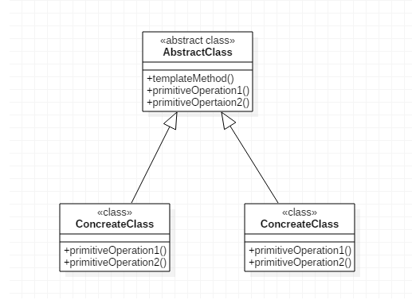
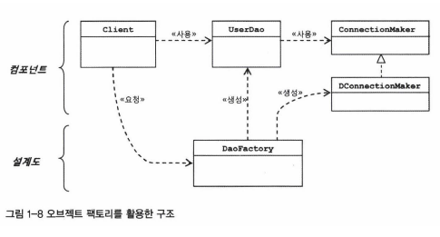
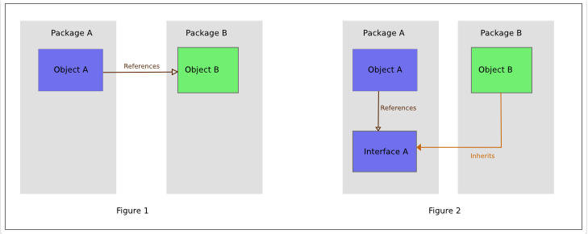
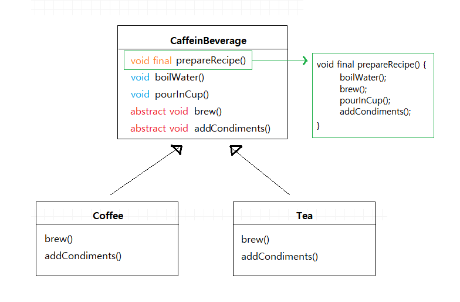
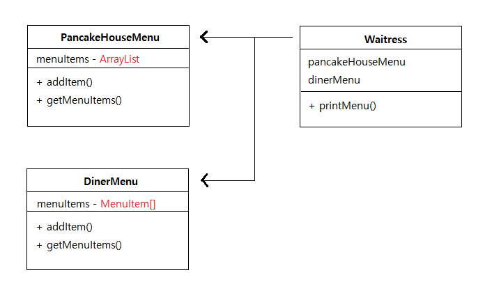
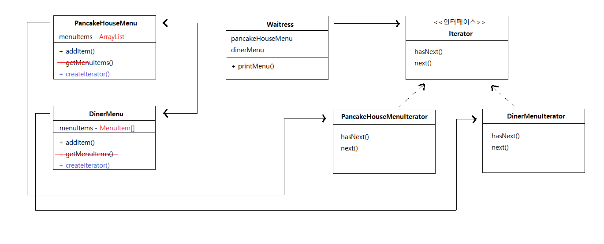
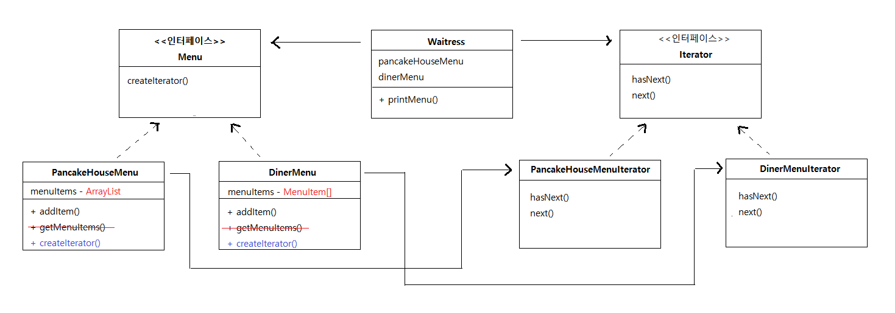
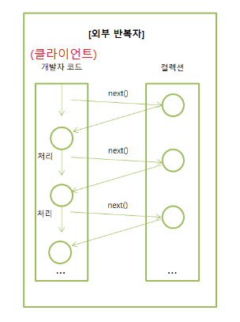
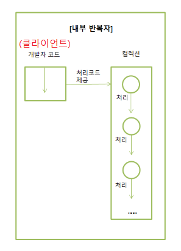

7주차 - Template Method Pattern & Iterator Pattern
=======
2019.11.23: 템플릿 메소드 패턴, 이터레이터 패턴  
해가 넘어가기 전에 끝내기 위해 이터레이터 패턴까지 나감  
추후 수정 및 추가
- - - -
## 목차
1. [템플릿 메소드 패턴](#템플릿-메소드-패턴)
	* [패턴 비교](#패턴-비교)
	* [헐리우드 원칙](#헐리우드-원칙)
		* [IoC vs DIP](#IoC-vs-DIP)
	* [템플릿 메소드 패턴이란](#템플릿-메소드-패턴이란)
2. [이터레이터 패턴](#이터레이터-패턴)
	* [이터레이터 패턴이란](#이터레이터-패턴이란)
		* [Iterator와 Iterable](#Iterator와-Iterable)
		* [자바 반복자 인터페이스](#자바-반복자-인터페이스)
	* [내부 반복자와 외부 반복자](#내부-반복자와-외부-반복자)
		* [반대 방향 순회](#반대-방향-순회)
	* [자바 Enumeration 인터페이스](#자바-Enumeration-인터페이스)
3. [기타](#기타)
	* [반환형이 boolean인 메소드 구현부](#반환형이-boolean인-메소드-구현부)
	* [this vs super](#this-vs-super)
	* RestTemplate
	* 테스트
	* 
4. [참고](#참고)
	
## 템플릿 메소드 패턴
예습을 못해갔다. 다만 코드스피츠 오브젝트 강의에서 [템플릿 메소드 패턴](https://github.com/nara1030/portfolio/blob/master/docs/lecture_list/code_spitz/s83_object1/object1_ch10.md#%ED%85%9C%ED%94%8C%EB%A6%BF-%EB%A9%94%EC%86%8C%EB%93%9C-%ED%8C%A8%ED%84%B4)에 대해 얼핏 얘기한 부분이 있어서 기억을 더듬으며 들었다.

### 패턴 비교
템플릿 메소드 패턴과 헷갈리기 쉬운(~~접점이 있는~~) 패턴들을 소개한다.

* `템플릿 메소드 패턴` vs `스트래티지 패턴`
	* 간결하게 정리하면, [`상속` vs `구현`](https://github.com/nara1030/portfolio/blob/master/docs/lecture_list/code_spitz/s83_object1/object1_ch10.md#%ED%95%A9%EC%84%B1%EA%B3%BC-%EC%9D%98%EC%A1%B4%EC%84%B1)이라고 할 수 있음
	* 템플릿 메소드 패턴  
		</br>
		* 메소드(`Abstract Class`)에서 `알고리즘의 골격`을 정의(추상 메소드에서 알고리즘을 독점)
		* 서브클래스에서는 특정 단계의 일부를 재정의, 즉 알고리즘의 골격은 그대로 유지
	* 스트레티지 패턴
		* 변화 가능한 행동을 캡슐화하고 그 행동들을 서로 바꿔가면서 사용할 수 있게 함
		* 일련의 행동들이 서브클래스에 캡슐화되어 있음(템플릿 메소드 패턴과는 다르게 알고리즘 골격이 교체)
* `템플릿 메소드 패턴` vs `팩토리 메소드 패턴`
	* .

##### [목차로 이동](#목차)

### 헐리우드 원칙
객체지향 디자인 원칙 중 자주 언급되는 것이 헐리우드 원칙(Hollywood Principle)이다.

> "우리한테 연락하지 마세요. 우리가 당신에게 연락할게요."

GoF의 디자인 패턴을 보면 위 내용은 다음과 같다([헐리우드 원칙 - 기계인간](https://johngrib.github.io/wiki/hollywood-principle/)).

> 템플릿 메소드는 `할리우드 원칙`이라는 **역전된 제어 구조**를 끌어낸다. 다시 말해, 부모 클래스(`고수준 구성요소`)는 서브클래스(`저수준 구성요소`)에 정의된 연산을 호출할 수 있지만 반대 방향의 호출은 안 된다.

위에서 **제어의 역전**(`IoC`)라는 용어를 사용했는데 이는, 서브클래스의 제어 권한을 상위 클래스(추상 클래스)에 넘긴다는 개념이다. 즉, 템플릿 메소드 패턴과 일맥상통함을 알 수 있다. 첨언하자면, IoC 개념은 프레임워크와 라이브러리의 차이에서도 확인할 수 있다. 전통적인 프로그래밍에서는 프로그래머의 코드**가** 라이브러리를 호출하지만, 제어 반전이 적용된 구조에서는 프레임워크가 프로그래머의 코드**를** 호출한다. 이런 관점에서 템플릿 메소드 패턴은 프레임워크를 만드는 데 아주 훌륭한 디자인 도구이다.

이러한 헐리우드 원칙을 활용하면 의존성 부패(`dependency rot`)을 방지할 수 있다.

##### [목차로 이동](#목차)

#### IoC vs DIP
* 제어의 역전  
	</br>
* 의존성 뒤집기 원칙(Dependency Inversion Principle: DIP)  
	</br>

##### [목차로 이동](#목차)

### 템플릿 메소드 패턴이란
패턴간 비교하며 간략히 얘기했지만 좀 더 적어본다. 흔히 `상속보다는 구현을 사용하라`는 말에도 불구하고 템플릿 메소드는 상속을 잘 사용한 거의 유일한 예다(~~그렇게 들음~~). 아래 클래스 다이어그램을 통해 살펴보자.

</br>

템플릿 메소드 패턴을 이해하기 위해 추상 클래스인 `CaffeineBeverage` 클래스의 구조를 한 번 살펴보면 `prepareRecipe()` 메소드가 **템플릿 메소드**임을 알 수 있다. 왜냐하면 일련의 알고리즘(이 경우 카페인이 들어있는 음료를 만들기 위한 알고리즘)에 대한 골격(틀) 역할을 하기 때문이다(외부 호출 의도). 즉, 템플릿 메소드에서는 알고리즘의 각 단계를 정의하며, 그 중 한 개 이상의 단계가 서브클래스에 의해 제공될 수 있다. 추가로, 템플릿 메소드의 접근 제한자는 `final`로 선언해야 한다. 이 경우를 예로 들면 `Tea`와 `Coffee`를 만들 때 `prepareRecipe()` 메소드를 사용하는데, 서브클래스에서 이를 오버라이드하여 임의로 음료를 만들면 안 되기 때문이다.

코드를 통해 추상 클래스에 들어갈 수 있는 메소드 형식에 대해 조금 더 자세히 살펴볼 수 있다.

```java
abstract class AbstractClass {
	final void templateMethod() {
		primitiveOperation1();
		primitiveOperation2();
		concreteOperation();
		hook();
	}
	
	abstract void primitiveOperation1();
	
	abstract void primitiveOperation2();
	
	final void concreteOperation() {
		// concreteOperation() 코드
	}
	
	void hook() {
		// 공백
	}
}
```

코드를 보면 `concreteOperation()` 메소드와 `hook()` 메소드가 추가되었음을 볼 수 있다. 

* `concreteOperation()` 메소드
	* 추상 클래스 내에서 정의되지만 서브클래스에서 오버라이드할 수 없는 구상 메소드(∵ `final` 키워드)
	* 호출 위치는 무관(템플릿 메소드에서 직접 호출 혹은 서브클래스에서 호출)
		* 하지만 서브클래스에서 호출하는 것은 권장하지 않음(∵ 헐리우드 원칙 위배, 순환 의존성 생김)
* `hook()` 메소드
	* 기본적으로 아무 것도 구현되지 않은 구상 메소드로 `후크`라 명명
	* 서브클래스에서 오버라이드할 수 있으나 선택 사항

`hook()` 메소드에 대한 첨언이 있었는데 특정 타이밍에 어떤 로직이 끼어드는 용도로 많이 사용된다고 한다(ex. `UI component`). 추후 추가.

##### [목차로 이동](#목차)


## 이터레이터 패턴
처음 접했을 때는 컬렉션의 요소를 꺼내는 방법이 어렵게 다가왔었는데, 이것이 이터레이터 패턴이라는 하나의 패턴임을 알게 되어서 조금은 눈을 뜬 느낌이다.

이 패턴의 필요성에 대해 간단하게 소개하면, Iterator를 매개변수로 받아들이는 메소드를 만들면 다형적인 반복작업을 사용할 수 있게 된다. 컬렉션의 구현 방식과는 무관하게 Iterator를 지원(직접 구현 아님)하는 어떠한 컬렉션에 대해서도 반복작업을 할 수 있기 때문이다.

### 이터레이터 패턴이란
책에 나와 있는 예는 아래 UML과 같다.

</br>

즉, 두 식당의 메뉴 구현(`컬렉션`과 `배열`)이 다른데 주문은 한 곳에서 통합하려는 상황이다. 따라서 웨이트리스가 두 식당의 메뉴를 출력할 수 있어야 한다(`Waitress` 클래스의 `printMenu()` 메소드). 하지만 각 메뉴가 똑같은 인터페이스를 구현하고 있지 않아서 불편하다(사실 `getMenuItems()` 메소드의 리턴 형식을 제외하면 동일).

* 구상 객체에 직접 의존(`DIP` 위반)
* 코드 중복
* 코드 관리 및 확장 어려움(`OCP` 위반)

간단히 `Waitress` 클래스의 코드를 살펴보면 이를 알 수 있다.

```java
// 클래스 선언부 생략
PancakeHouseMenu pancakeHouseMenu = new PancakeHouseMenu();		// 생성 동시 addItem() 메소드 이용 초기화
ArrayList<MenuItem> breakfastItems = pancakeHouseMenu.getMenuItems();	// 책 집필 이후 제네릭 도입

DinerMenu dinerMenu = new DinerMenu();	// 생성 동시 addItem() 메소드 이용 초기화
MenuItem[] lunchItems = dinerMenu.getMenuItems();

for(int i = 0; i < breakfastItems.size(); i++) {
	MenuItem menuItem = breakfastItems.get(i);
	System.out.print(menuItem.getName() + " ");
	System.out.println(menuItem.getPrice() + " ");
	System.out.println(menuItem.getDescription());
}

for(int i = 0; i < lunchItems.length; i++) {
	MenuItem menuItem = lunchItems[i];
	System.out.print(menuItem.getName() + " ");
	System.out.println(menuItem.getPrice() + " ");
	System.out.println(menuItem.getDescription());	
}
```

객체지향의 설계 원칙 중 가장 중요한 것이 `바뀌는 부분을 캡슐화하라`라는 내용이었다. 그리고 위 코드에서 바뀌는 부분은 (메뉴에서 리턴되는 컬렉션 객체의 형식의 차이로 인한) 반복 작업이다. 이는 **이터레이터 패턴**으로 반복 작업을 캡슐화함으로써 리팩토링할 수 있다. 먼저 이터레이터(`Iterator`), 즉 반복자 패턴을 사용하면 예제의 UML이 어떻게 변화되는지 살펴본다.

</br>

* `컬렉션 관리`와 `반복 작업` 분리
	* 컬렉션 관리 클래스(`DinerMenu`)는 `Iterator` 인터페이스 리턴 기능만 있으면 됨(`createIterator()` 메소드)  
	  구상 Iterator 클래스(`DinerMenuIterator`)에서 반복 작업 처리  
	* 컬렉션 관리 객체 혹은 클라이언트(`Waitress`)에서는 반복 작업에 대해 알 필요가 없음  
	  비슷한 맥락에서 내부 구조를 드러내는 `getMenuItems()` 메소드를 컬렉션 관리 클래스에서 제거
* Iterator 인터페이스는 임의의 컬렉션 객체에 대해 반복자(Concrete) 구현 가능

이후 `Waitress` 코드는 아래와 같이 변한다.

```java
public class Waitress {
	PancakeHouseMenu pancakeHouseMenu;
	DinerMenu dinerMenu;
	
	public Waitress(PancakeHouseMenu pancakeHouseMenu, DinerMenu dinerMenu) {
		this.pancakeHouseMenu = pancakeHouseMenu;
		this.dinerMenu = dinerMenu;
	}
	
	public void printMenu() {
		Iterator pancakeIterator = pancakeHouseMenu.createIterator();
		Iterator dinerIterator = dinerMenu.createIterator();
		System.out.println("메뉴\n---\n아침메뉴");
		printMenu(pancakeIterator);
		System.out.println("\n점심메뉴");
		printMenu(dinerIterator);
	}
	
	private void printMenu(Iterator iterator) {
		while(iterator.hasNext()) {
			MenuItem menuItem = iterator.next();	// 형 변환 불필요(∵ 제네릭)
			System.out.print(menuItem.getName() + ", ");
			System.out.print(menuItem.getPrice() + " -- ");
			System.out.println(menuItem.getDescription());
		}
	}
}
```

기존에 반복 작업을 처리하기 위해 순환문 두 개가 필요했었는데 Iterator를 구현했기에 어떠한 컬렉션이 추가되든지 하나의 순환문으로 처리할 수 있다. 하지만 맨 처음에 문제점으로 지적했던 구상 객체에 대한 직접 의존성이 제거되지 않았다(`DIP` 위반). 다시 말해 `PancakeHouseMenu`와  `DinerMenu`의 인터페이스가 완전히 똑같음에도 불구하고 아직 인터페이스를 통일시키지 않았다. 이를 통일시키면 아래와 같다.

</br>

즉, 아래와 같이 `Waitress` 클래스와 구상 클래스 사이의 의존성을 줄일 수 있다.

```java
public class Waitress {
	Menu pancakeHouseMenu;
	Menu dinerMenu;
	
	public Waitress(Menu pancakeHouseMenu, Menu dinerMenu) {
		this.pancakeHouseMenu = pancakeHouseMenu;
		this.dinerMenu = dinerMenu;
	}
	
	public void printMenu() {
		Iterator pancakeIterator = pancakeHouseMenu.createIterator();
		Iterator dinerIterator = dinerMenu.createIterator();
		System.out.println("메뉴\n---\n아침메뉴");
		printMenu(pancakeIterator);
		System.out.println("\n점심메뉴");
		printMenu(dinerIterator);
	}
	
	private void printMenu(Iterator iterator) {
		while(iterator.hasNext()) {
			MenuItem menuItem = iterator.next();	// 형 변환 불필요(∵ 제네릭)
			System.out.print(menuItem.getName() + ", ");
			System.out.print(menuItem.getPrice() + " -- ");
			System.out.println(menuItem.getDescription());
		}
	}
}
```

정리하면. p373-4.

##### [목차로 이동](#목차)

#### Iterator와 Iterable
[링크 1](https://92bluemoon.netlify.com/posts/iterator-iterable/)  
[링크 2](https://wedul.site/459)  
[링크 3](http://wonwoo.ml/index.php/post/1812)

##### [목차로 이동](#목차)

#### 자바 반복자 인터페이스
p370-1.

##### [목차로 이동](#목차)

### 내부 반복자와 외부 반복자
* 외부 반복자(external iterator)
	* 개발자가 코드로 직접 컬렉션의 요소를 반복해서 가져오는 코드 패턴  
	  (클라이언트에서 `next()`를 호출해서 다음 항목을 가져오기 때문에, 클라이언트가 반복작업을 제어)  
	  </br>
	* 예
		* index를 사용하는 for문
		* Iterator를 이용하는 while문
* 내부 반복자(internal iterator)
	* 컬렉션 내부에서 요소들을 반복시키고, 개발자는 요소당 처리해야 할 코드만 제공하는 코드 패턴  
	  (클라이언트가 반복작업을 마음대로 제어할 수 없기 때문에 외부 반복자를 사용하는 경우에 비해 유연성 감소)  
	  </br>
	* 예
		* Java8의 Stream(Java I/O Stream과 무관)  

부연하자면 자바 7 이전까지는 `List<String>` 컬렉션에서 요소를 순차적으로 처리하기 위해 `Iterator` 반복자를 사용해왔다. 헌데 자바 8부터 스트림(Stream)이라는 반복자를 지원해줌으로써 컬렉션(배열 포함)의 저장 요소를 하나씩 참조해서 람다식(함수적 스타일)으로 처리할 수 있게 되었다. 즉 **Stream**은 Iterator와 비슷한 역할을 하는 반복자이지만, 람다식으로 요소 처리 코드를 제공하는 점과 내부 반복자를 사용하므로 병렬 처리가 쉽다는 점 그리고 중간 처리와 최종 처리 작업을 수행하는 점에서 차이가 있다. 아래 코드에서 그 차이를 살펴볼 수 있다.

```java
// 선언부 생략
List<String> list = Arrays.asList("홍길동", "신용권", "감자바");

// Iterator 이용
Iterator<String> iterator = list.iterator();
while(iterator.hasNext()) {
	String name = iterator.next();
	System.out.println(name);
}

// Stream 이용
Stream<String> stream = list.stream();
stream.forEach(name -> System.out.println(name));
```

스트림 및 람다식에 대해서는 따로 깊이 공부(-> [스트림과 병렬처리](https://github.com/nara1030/ThisIsJava/blob/master/docs/%EC%8A%A4%ED%8A%B8%EB%A6%BC%EA%B3%BC%20%EB%B3%91%EB%A0%AC%EC%B2%98%EB%A6%AC.md))할 필요가 있어 보인다.

##### [목차로 이동](#목차)

#### 반대 방향 순회
단방향(순방향)이 아닌 양방향으로 움직이는 반복자를 만들 수도 있다. 이 경우 두 가지 메소드를 추가해주어야 한다.

* 이전 항목으로 가기 위한 메소드
* 원소 컬렉션에서 첫 번째 원소 위치에 있는지를 알려주는 메소드

자바의 컬렉션 프레임워크에서는 `ListIterator`라는 반복자 인터페이스를 제공하는데, 이 인터페이스에는 표준 `Iterator` 인터페이스에 있는 메소드 외에도 `previous()`를 비롯한 몇 개의 인터페이스가 추가되어 있다.

추후 추가.

- - -
이에 대해 얘기하다가 [`대중교통 노선 관련`](https://v4.map.naver.com/local/siteview.nhn?stationId=140&theme=subway) 코드 역순회 코드 구현 경험이 언급됐다(~~코드의 미학적 측면이 마음에 들지 않아 롤백했다고~~). 그에 대한 예로 간단한 코드가 언급됐다.

```java
import java.util.List;
import java.util.ListIterator;
import java.util.stream.Collectors;
import java.util.stream.IntStream;

public class First {
	Iterable<Integer> iterable1 = IntStream.iterate(0, n -> n + 1)
			.limit(10)
			.boxed()
			.collect(Collectors.toList());
	
	List<Integer> iterable2 = IntStream.iterate(0, n -> n + 1)
			.limit(10)
			.boxed()
			.collect(Collectors.toList());
	
	ListIterator<Integer> iterator = iterable2.listIterator();
}
```

위 코드 추후 수정.

##### [목차로 이동](#목차)

### 자바 Enumeration 인터페이스


##### [목차로 이동](#목차)

## 기타
주제 외에 스터디에서 언급하고 넘어갔던 부분에 대해 정리한다.

### 반환형이 boolean인 메소드 구현부
흔히 아래와 같이 구현된 코드를 많이 볼 수 있다고 한다(여기서는 책의 예를 그대로 인용).

```java
public boolean customerWantsCondiments() {
	String answer = getUserInput();
	
	if(answer.toLowerCase().startWith("y") {
		return true;
	} else {
		return false;
	}
}
```

이는 아래와 같이 변경하는 게 좋다.

```java
public boolean customerWantsCondiments() {
	String answer = getUserInput();
	return answer.toLowerCase().startWith("y");
}
```

##### [목차로 이동](#목차)

### this vs super
어떤 맥락에서 시작된 대화인지는 기억이 안 나는데 `super` 키워드를 사용하는 게 안 좋다, 이는 **Method Dispatch**의 관점에서 `this`와 차이가 있다고 했다. 여기서 Method Dispatch란 어떤 메소드를 호출할지 결정하여 실제로 실행시키는 과정을 말한다.

* `this`: dynamic dispatch 됨
	* 구현체에 따라 `Runtime`에 달라짐
* `super`: dynamic dispatch 안됨
	* `Compile time`에 이미 결정
	* 강결합이므로 웬만하면 쓰지 않는 것을 권장

추후 수정. [참고](https://defacto-standard.tistory.com/413)

##### [목차로 이동](#목차)

## 참고
* [헤드퍼스트 디자인 패턴: 9. 템플릿 메소드 패턴](https://plposer.tistory.com/26)
* 헐리우드 원칙 vs 의존성 뒤집기 원칙
	* [헐리우드 원칙 - 기계인간](https://johngrib.github.io/wiki/hollywood-principle/)
	* [의존성 뒤집기 원칙 - 제타위키](https://zetawiki.com/wiki/%EC%9D%98%EC%A1%B4%EC%84%B1_%EB%92%A4%EC%A7%91%EA%B8%B0_%EC%9B%90%EC%B9%99)
	* [DI는 IoC를 사용하지 않아도 된다 by Jin-Wook Chung](https://jwchung.github.io/DI%EB%8A%94-IoC%EB%A5%BC-%EC%82%AC%EC%9A%A9%ED%95%98%EC%A7%80-%EC%95%8A%EC%95%84%EB%8F%84-%EB%90%9C%EB%8B%A4)
	* 스프링과 IoC
		* [제어의 역전(IoC)이란 무엇인가](https://vandbt.tistory.com/43)
		* [오브젝트 설계와 제어의 역전 - 주토피아](https://joooootopia.tistory.com/19)
		* [IoC - 제어의 역전](https://choiwy.tistory.com/38)
		* [IoC? DIP? IoC Container? DI? DI Framework? 도대체 그게 뭔데? - wickedev](https://velog.io/@wickedev/IoC-DIP-IoC-Container-DI-DI-Framework-%EB%8F%84%EB%8C%80%EC%B2%B4-%EA%B7%B8%EA%B2%8C-%EB%AD%94%EB%8D%B0)
		* [IoC의 이해](http://wiki.gurubee.net/pages/viewpage.action?pageId=26740787)
* [Java - static method dispatch, dynamic method dispatch, double dispatch](https://defacto-standard.tistory.com/413)
- - -
* [템플릿 메소드 패턴 - 꿈꾸는 지구별 개발자](https://jihyehwang09.github.io/2019/11/24/design-pattern-template-method/)
	
##### [목차로 이동](#목차)