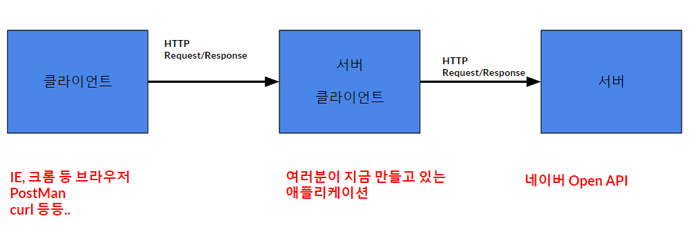
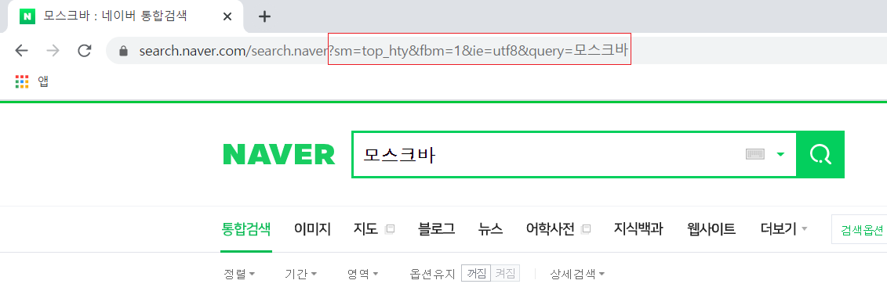

1주차 - AutoConfiguration, Embedded Tomcat
=====
* 일시: 2020.01.03(금), 11:30 ~ 13:30
* 장소: 삼성역 스터디룸
- - -
## 목차
1. [참고](#참고)
2. [진행](#진행)
	* [요구사항](#요구사항)
	* [설명](#설명)
3. [기타](#기타)
	* [Spring MVC vs Spring Boot](#Spring-MVC-vs-Spring-Boot)
	* [API vs Library](#API-vs-Library)

## 참고
* [발표 자료](https://docs.google.com/presentation/d/1Eb05e4tT8LqZ_szpuk69-pjwjGXHIqtCORVVo2KxYiM/edit#slide=id.p)
* 실습
	* [요구사항: STEP01](https://github.com/spring-basic-study/openapi)
* 기타
	* [스프링부트 AutoConfiguration에 대해 샘플코드로 이해하기](https://brunch.co.kr/@springboot/199)
	* [스프링부트 Profile 설정](https://dhsim86.github.io/web/2017/03/28/spring_boot_profile-post.html)
	* [스프링부트 환경에서 Tomcat 설정 및 성능 검토하기](https://brunch.co.kr/@springboot/98)
	* [스프링5 웹플럭스 정리 및 샘플코드](https://brunch.co.kr/@springboot/96)

- - -
* [초보 개발자가 이해하는 HTTP Content-Type](https://kdevkr.github.io/archives/2018/understanding-http-content-types/)
	
##### [목차로 이동](#목차)

## 진행
불참한 관계로 차주 진행을 위해 준비사항을 적는다.

* ~~깃 계정 생성(∵ 코드 리뷰)~~([참고](https://github.com/next-step/nextstep-docs/blob/master/codereview/review-step1.md)) 
* 인텔리제이 설치 후 스프링부트 환경에서 `hello world` 띄워보기
	* ~~Ultimate 버전~~
	* Community 버전
* 네이버 API에서 오픈 API 사용 권한 받기 및 이용 방법
	* [API 공통 가이드](https://developers.naver.com/docs/common/openapiguide/README.md)
	* [API 검색 > 블로그](https://developers.naver.com/docs/search/blog/)

### 요구사항

**STEP01**

1. 네이버 오픈API 를 연동해서, query(파라미터)로 검색어를 전달해서 블로그 정보를 조회한다.
	* https://developers.naver.com/docs/search/blog/
	* https://developers.naver.com/docs/common/openapiguide/apilist.md#%EA%B2%80%EC%83%89
2. OpenAPI 연동 URL,인증키 등 정보를 application 파일에 설정
3. application파일에 정의한 정보를 @ConfigurationProperties, @EnableConfigurationProperties 어노테이션을 사용해서 가져오기 
4. "local" profile 로 애플리케이션 실행
5. Embedded Tomcat Port, Max Thread 설정(`확인 어디서?`) 변경해보기
6. Service or Repository 패키지 레이어로 분리해보기
7. Open API 호출 시 RestTemplate를 사용하며, 별도의 Bean 으로 정의한다.(@Configuration, @Bean 사용)
8. Lombok 버전을 내가 원하는 버전으로 디펜던시 변경해보기
	
##### [목차로 이동](#목차)

### 설명
요구사항에 대한 개략적인 이해를 적어본다. 먼저 우리가 작성할 애플리케이션은 이와 같은 구조를 가진다.

</br>

즉 사용자가 우리가 만든 애플리케이션의 URL에 접속하면 우리 애플리케이션은 내부적으로 네이버의 OPEN API를 호출하는 구조이다. 위 그림에도 나타나 있듯이 서버와 클라이언트의 요청/응답은 HTTP 프로토콜([자세히](https://github.com/nara1030/TIL/blob/master/docs/book/mashup_guide_for_open_api/ch_1.md#Request%EC%99%80-Response)) 위에서 이루어진다. 즉 HTTP에서는 클라이언트가 요청을 보내면 서버가 응답을 보내주는 구조이며 이를 HTTP 메시지라고 한다. 한편 HTTP는 주어진 리소스에 필요한 액션이 수행되게 하는 요청 메소드 집합(HTTP request methods)을 정의한다.

| 요청 메소드 | 설명 |
| -- | -- |
| GET | 특정 리소스(URI)의 표시 요청(오직 데이터 수신) |
| POST | 특정 리소스(URI)에 엔티티 제출(서버의 상태 변화 야기) |

두 방식 모두 클라이언트가 서버에 요청을 하는 메서드이지만 차이점([참고](https://mommoo.tistory.com/60))이 있다.

* GET 방식으로 데이터 보내기  
	</br>
	* URL에 데이터(key-value)를 붙이므로 HTTP 패킷의 헤더에 포함
		* ∴ GET 방식에서 BODY는 빈 상태로 보내짐 
		* ∴ 헤더의 내용 중 BODY 데이터를 설명하는 [Content-Type](https://www.geeksforgeeks.org/http-headers-content-type/) 헤더 필드 제외
* POST 방식으로 데이터 보내기
	* GET 방식과 다르게 URL에 붙여서 보내지 않고 BODY에 데이터를 넣어서 보냄
	* ∴ 헤더 필드 중 BODY의 데이터를 설명하는 Content-Type 포함  
		```
		// 예
		Content-Type : applcation/x-www-form-urlencoded		// key-value
		Content-Type : text/plain				// txt
		Content-Type : multipart/form-data		// binary
		```

여기서는 요구사항 1에서 확인할 수 있듯 GET 요청 방식을 사용한다. 

- - -


##### [목차로 이동](#목차)

## 기타

### Spring MVC vs Spring Boot
* [Spring Boot App의 간단한 빌드와 런](https://velog.io/@drypot/Spring-Boot-App-%EC%9D%98-%EA%B0%84%EB%8B%A8%ED%95%9C-%EB%B9%8C%EB%93%9C%EC%99%80-%EB%9F%B0-)
* [Spring Boot vs. Spring MVC vs. Spring: How Do They Compare?](https://dzone.com/articles/spring-boot-vs-spring-mvc-vs-spring-how-do-they-compare)
* AutoConfiguration
	* [스프링캠프 2016 이수홍님 발표자료](https://github.com/sbcoba/spring-camp-2016-spring-boot-autoconfiguration)
	* [스프링부트 AutoConfiguration 개발](https://luvstudy.tistory.com/69)

##### [목차로 이동](#목차)

### API vs Library
API는 명세.

##### [목차로 이동](#목차)
