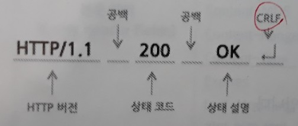

1주차 - AutoConfiguration, Embedded Tomcat
=====
* 일시: 2020.01.03(금), 11:30 ~ 13:30
* 장소: 삼성역 스터디룸
- - -
## 목차
1. [참고](#참고)
2. [진행](#진행)
	* [요구사항](#요구사항)
	* [상세설명](#상세설명)
	* [코드리뷰](#코드리뷰)
3. [기타](#기타)
	* [Spring MVC vs Spring Boot](#Spring-MVC-vs-Spring-Boot)
	* [API vs Library](#API-vs-Library)

## 참고
* [발표 자료](https://docs.google.com/presentation/d/1Eb05e4tT8LqZ_szpuk69-pjwjGXHIqtCORVVo2KxYiM/edit#slide=id.p)
* 실습
	* [요구사항: STEP01](https://github.com/spring-basic-study/openapi)
* 기타
	* [스프링부트 AutoConfiguration에 대해 샘플코드로 이해하기](https://brunch.co.kr/@springboot/199)
	* [스프링부트 Profile 설정](https://dhsim86.github.io/web/2017/03/28/spring_boot_profile-post.html)
	* [스프링부트 환경에서 Tomcat 설정 및 성능 검토하기](https://brunch.co.kr/@springboot/98)
	* [스프링5 웹플럭스 정리 및 샘플코드](https://brunch.co.kr/@springboot/96)

- - -
* [초보 개발자가 이해하는 HTTP Content-Type](https://kdevkr.github.io/archives/2018/understanding-http-content-types/)
	
##### [목차로 이동](#목차)

## 진행
불참한 관계로 차주 진행을 위해 준비사항을 적는다.

* ~~깃 계정 생성(∵ 코드 리뷰)~~([참고](https://github.com/next-step/nextstep-docs/blob/master/codereview/review-step1.md)) 
* 인텔리제이 설치 후 스프링부트 환경에서 `hello world` 띄워보기
	* ~~Ultimate 버전~~
	* Community 버전
* 네이버 API에서 오픈 API 사용 권한 받기 및 이용 방법
	* [API 공통 가이드](https://developers.naver.com/docs/common/openapiguide/README.md)
	* [API 검색 > 블로그](https://developers.naver.com/docs/search/blog/)

##### [목차로 이동](#목차)
	
### 요구사항

**STEP01**: [작성 코드](https://github.com/nara1030/TIL/tree/master/docs/study/springboot/src/fri-springboot-study/src/main/java/com/eom/frispringbootstudy)

1. 네이버 오픈API 를 연동해서, query(파라미터)로 검색어를 전달해서 블로그 정보를 조회한다.
	* https://developers.naver.com/docs/search/blog/
	* https://developers.naver.com/docs/common/openapiguide/apilist.md#%EA%B2%80%EC%83%89
2. OpenAPI 연동 URL,인증키 등 정보를 application 파일에 설정
3. application파일에 정의한 정보를 @ConfigurationProperties, @EnableConfigurationProperties 어노테이션을 사용해서 가져오기 
4. "local" profile 로 애플리케이션 실행
5. Embedded Tomcat Port, Max Thread 설정 변경해보기
6. Service or Repository 패키지 레이어로 분리해보기
7. Open API 호출 시 RestTemplate를 사용하며, 별도의 Bean 으로 정의한다.(@Configuration, @Bean 사용)
8. Lombok 버전을 내가 원하는 버전으로 디펜던시 변경해보기

##### [목차로 이동](#목차)

### 상세설명
요구사항에 대한 개략적인 이해를 적어본다. 먼저 우리가 작성할 애플리케이션은 이와 같은 구조를 가진다.

</br>

즉 사용자가 우리가 만든 애플리케이션의 URL에 접속하면 우리 애플리케이션은 내부적으로 네이버의 OPEN API를 호출하는 구조이다. 아래 실행 결과(~~status code is 200 but failed to load response data~~)를 참고한다.

</br>

위 그림에도 나타나 있듯이 HTTP 프로토콜 위에서의 클라이언트의 요청은 HTTP (Request) Method를 통해 이루어진다([자세히](https://github.com/nara1030/TIL/blob/master/docs/book/mashup_guide_for_open_api/ch_1.md#Request%EC%99%80-Response)). HTTP Method란, GET/POST/PUT과 같이 HTTP 프로토콜 사용 시의 호출 방식을 말한다.

| 요청 메소드 | 설명 |
| -- | -- |
| GET | 특정 리소스(URI)의 표시 요청(오직 데이터 수신) |
| POST | 특정 리소스(URI)에 엔티티 제출(서버의 상태 변화 야기) |

두 방식 모두 클라이언트가 서버에 요청을 하는 메서드이지만 차이점([참고](https://mommoo.tistory.com/60))이 있다.

* GET 방식으로 데이터 보내기  
	</br>
	* URL에 데이터(key-value)를 붙이므로 HTTP 패킷의 헤더에 포함
		* ∴ GET 방식에서 BODY는 빈 상태로 보내짐 
		* ∴ 헤더의 내용 중 BODY 데이터를 설명하는 [Content-Type](https://www.geeksforgeeks.org/http-headers-content-type/) 헤더 필드 제외
		* 바이너리 및 대용량 데이터 전송 불가(∵ 웹 서버에 따라 요청라인과 헤더 필드의 최대 크기 제한)
			* HTTP 사양에서는 요청 라인이나 헤더 필드의 최대 크기 제한하지 않지만, 웹 서버에서 제한
				* ∵ 대용량 URL을 사용할 때 발생할 수 있는 보안 문제
			* 예
				* Microsoft IIS 6.0+: 16KB
				* Apache: 8KB
	* 요청 형식
		1. 요청 라인(Request-Line): 요청하는 자원에 대해 웹 서버에게 내리는 명령  
			</br>
		2. 요청 헤더: 요청 처리 시 참고하라고 웹 서버에게 알려주는 정보  
			</br>
	* 응답 형식
		1. 상태 라인(Status-Line): 응답 결과에 대한 상태 정보  
			</br>
		2. 응답 헤더: 응답 데이터 처리 시 참고하라고 웹 브라우저에게 알려주는 정보  
			```txt
			// Content-Type 헤더는 서버가 웹 브라우저에게 보내는 데이터의 형식
			// 웹 브라우저는 이 헤더 값을 보고 데이터를 출력할지, 다운로드 창을 띄울지
			// 아니면 외부 프로그램을 실행할지 결정
			Content - Type: text/html; charset=UTF-8
			// Content-Length는 웹 브라우저에게 보내는 데이터(message-body)의 크기(Byte)
			Content - Length: 34770
			```
		3. 공백 라인과 응답 데이터(message-body)
* POST 방식으로 데이터 보내기
	* GET 방식과 다르게 URL에 붙여서 보내지 않고 BODY에 데이터를 넣어서 보냄
	* ∴ 헤더 필드 중 BODY의 데이터를 설명하는 Content-Type 포함  
		```
		// 예
		Content-Type : applcation/x-www-form-urlencoded	// key-value
		Content-Type : text/plain				// txt
		Content-Type : multipart/form-data			// binary
		```

- - -
지금까지 www 상에서 클라이언트와 서버가 HTTP 프로토콜 위에서 요청/응답한다는 것을 알아봤는데 좀 더 자세히 살펴본다.

</br>

* 클라이언트는 DNS를 통해서 naver.com의 IP 주소를 알 수 있다(1).
* 클라이언트는 애플리케이션(HTTP) 계층에서 HTTP 메시지를 작성한다(2).
* 클라이언트는 전송(TCP) 계층에서 HTTP를 패킷으로 분해한다(3).
* 클라이언트는 IP를 통해서 상대가 어디에 있는지 찾아 중계해 가면서 전송한다(4,5,6).
* 서버는 전송(TCP) 계층에서 패킷을 수신하고 조립한다(7).
* 서버는 클라이언트의 요청을 처리한다(8).

다음 [링크](https://github.com/nara1030/TIL/blob/master/docs/thinking_list/process_when_typing_a_url.md)를 참고한다.
	
- - -
요구사항에 대해 언급되었던 부분과 이해한 바를 적어본다.

* 요구사항 1: HTTP Request Method 중 GET 방식
	* Chrome에서 HTTP Message 확인: Chrome > F12 > Network 탭 > Name 탭
* 요구사항 2: 외부 설정을 통해 어플리케이션의 설정값 세팅
	* [How to use Spring Boot application.properties file to externalize configuration](https://www.theserverside.com/video/How-applicationproperties-simplifies-Spring-config)
	* [A Guide to Spring Boot Configuration Metadata](https://www.baeldung.com/spring-boot-configuration-metadata)
	* [스프링 부트 자동 설정 이해하기: @EnableAutoConfiguration](https://cornswrold.tistory.com/314)
	* [What is the difference between @ComponentScan and @EnableAutoConfiguration in Spring Boot?](https://stackoverflow.com/questions/35005158/what-is-the-difference-between-componentscan-and-enableautoconfiguration-in-sp)
* 요구사항 4: .
	* https://www.lesstif.com/pages/viewpage.action?pageId=18220309
* 요구사항 5: .
* 요구사항 6: 3-Tier / IoC
	* ReadOnly 특징을 가지는 VO(Value Object)와 달리 DTO(Data Transfer Object)는 가변(Mutable)임
		* DTO는 값을 전달(계층간 데이터 교환)하는 객체, VO는 상태가 있는 객체가 아닌 그저 값으로 취급하는 객체([자세히](https://multifrontgarden.tistory.com/182))
			* ∴ VO는 상태가 필요없기 때문에 불필요한 상태 변경 행위(setter) 구현 안함
			* ∴ 객체지향의 관점에서 보면 마음에 들지 않는 객체(때에 따라 VO를 Domain으로 명명하기도 함)
		* 대표적인 VO로는 String 및 Integer, Long 등 기본형 래핑 객체 있음(Immutable)
		* DTO만이 VO에 대해 알고 있어야 함(VO와 비슷한 JPA의 Entity?)
			* ∵ DTO는 출력화면의 변경에 따라 변경될 수 있지만 VO는 변경될 일이 없기 때문(VO는 DB 테이블과 직접 관계)([자세히](https://www.slipp.net/wiki/pages/viewpage.action?pageId=2031636))
	* DTO에 데이터(Property) 설정은 우리가 setter 요청하는 것이 아니라 프레임워크 내부에서 setter 요청
		* ∴ 즉 멤버변수는 아무렇게나 지어도 무관하며 setter/getter에서 set/get 이후에 나오는 단어가 property라고 약속(∵ 자바는 다양한 프레임워크에서 데이터 자동화처리를 위해 리플렉션 기법을 사용하는데 이때 가장 중요한 것이 표준규격)
		* 데이터를 받는 곳에서 일일이 처리할 필요 없이 이름과 매칭되는 프로퍼티에 자동적으로 DTO가 인스턴스화되어 값을 받음
	* VO vs. Map: 추후 공부
		* https://okky.kr/article/370609
* 요구사항 7: RestTemplate 사용 / 별도의 Bean 정의
	* 데이터를 요청하는 경우 기존의 클라이언트 라이브러리와 사용성에 차이가 없으나, 응답 시에 다양한 메시지 컨버터를 내장하고 있는 게 장점
		* 기존에도 Apache HttpClient, OKHttp와 같은 클라이언트 라이브러리 존재
		* RestTemplate은 다양한 메시지 컨버터를 이미 내장하고 있어 JSON 응답을 Map 또는 모델 클래스로 변환 사용 수월 장점(∵ REST API와 연동 시에는 HTTP 요청 보내는 것뿐 아니라 응답에 JSON 데이터를 파싱하고 모델 객체와 매핑하는 것이 중요)
	* 단, RestTemplate은 기본적으로 connection pool을 사용하지 않기 때문에 매 요청마다 handshake 수행
		* ∴ 중복 코드 최소화하기 위해 Bean 등록 필요
	* [RestTemplate GET Request with Parameters and Headers](https://attacomsian.com/blog/spring-boot-resttemplate-get-request-parameters-headers)
	* [The Guide to RestTemplate](https://www.baeldung.com/rest-template)
	* [Spring API(@RequestBody와 @ResponseEntity의 차이점)](https://dlgkstjq623.tistory.com/275)
	* [Using Spring ResponseEntity to Manipulate the HTTP Response](https://www.baeldung.com/spring-response-entity)
* 요구사항 8: setter/getter 대신 Lombok 사용 
	* 코드(DTO) 작성시 수정 쉽고 가독성 향상(∵ 필드명 변경시 setter/getter는 일일이 변경 필요)
	* 단, Gradle에 의존성 설정 외에 플러그인 추가 및 컴파일러 설정 필요([관련 링크](https://galid1.tistory.com/531))
	* [실무에서 Lombok 사용법](https://cheese10yun.github.io/lombok/)

##### [목차로 이동](#목차)

### 코드리뷰


##### [목차로 이동](#목차)

## 기타

### Spring MVC vs Spring Boot
* [Spring Boot App의 간단한 빌드와 런](https://velog.io/@drypot/Spring-Boot-App-%EC%9D%98-%EA%B0%84%EB%8B%A8%ED%95%9C-%EB%B9%8C%EB%93%9C%EC%99%80-%EB%9F%B0-)
* [Spring Boot vs. Spring MVC vs. Spring: How Do They Compare?](https://dzone.com/articles/spring-boot-vs-spring-mvc-vs-spring-how-do-they-compare)
* AutoConfiguration
	* [스프링캠프 2016 이수홍님 발표자료](https://github.com/sbcoba/spring-camp-2016-spring-boot-autoconfiguration)
	* [스프링부트 AutoConfiguration 개발](https://luvstudy.tistory.com/69)

##### [목차로 이동](#목차)

### API vs Library
API는 명세.

##### [목차로 이동](#목차)
