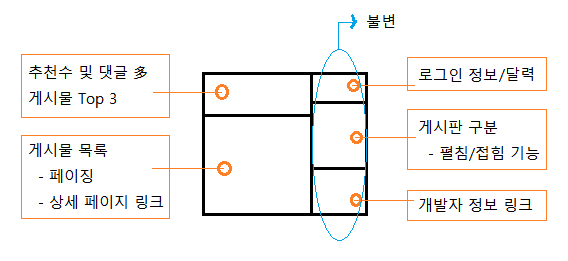

토이 프로젝트: 게시판
=====
게시판 기능과 구현 및 이슈를 정리합니다.
- - -
## 목차
1. [요구사항](#요구사항)
2. [구현](#구현)
3. [상세](#상세)
4. [참고](#참고)

## 요구사항
</br>

개략적인 메인 페이지 디자인은 위와 같다. 구체적인 기능은 다음과 같다.

* 게시판은 계층 구조를 갖음  
	```
	└─ 헥스볼
		├─ 전술
		├─ 팀/개인순위
		└─ 영상모음
	```
	* 펼침/숨김
		* 상위 메뉴를 누르면 하위 메뉴들이 펼쳐짐
	* 링크
		* 최하위 게시판 클릭시 해당 게시글 목록 보임
		* 특정 게시글 클릭시 게시글 내용 및 댓글 보임
	* 권한
		* 스탭 전용 게시판은 스탭만 열람 가능
* 추천 기능
	* 게시글 및 댓글 추천
* 로그인
	* 헥스볼 연동 고민
	* 세션 만료
* 마이페이지
	* 작성 게시글/댓글 확인

##### [목차로 이동](#목차)

## 구현
구현 기술 및 적용해보고 싶은 것 우선 작성.

* 디자인 패턴
	* Composite: 게시판
	* Observer: 실시간 데이터
* 배포/테스트
* D3
* 게시글 메일 전송
* MSA/RESTful/코틀린
* 자바8
* dhtmlx

##### [목차로 이동](#목차)

## 상세


##### [목차로 이동](#목차)

## 참고
* [SSO와 세션](https://linuxism.ustd.ip.or.kr/1516)

##### [목차로 이동](#목차)